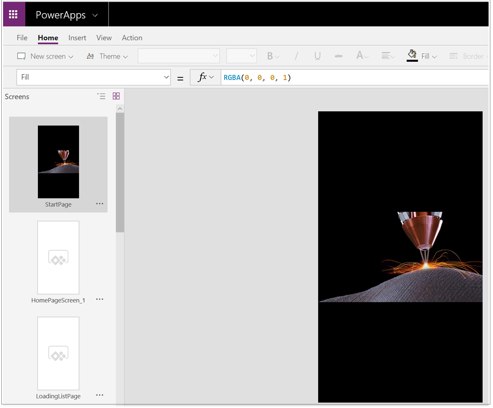

# PowerApps building blocks
In the first topic you read about the main parts of PowerApps. Now we're going to dive deeper on each of the parts. The PowerApps components are:

* **web.powerapps.com**: Apps start here using templates or sample apps.
* **PowerApps Studio**: Flesh out your apps with easily-place controls and buttons, and set up connections to your data.
* **PowerApps Mobile**: Run your apps on Windows, iOS, and Android devices.
* **PowerApps admin center**: Manage PowerApps environments and other components.

## web.powerapps.com
If you build apps, this is where you start. You build apps from sample apps, from templates, or from a blank slate. All the apps you've built will be seen here. You'll go back here often to see how your apps are shaping up.

## PowerApps Studio
PowerApps Studio is where you flesh out your apps to make them more effective as a business tool—and to make them more attractive. PowerApps Studio has three panes and a ribbon that make app creation feel more like building a slide deck in PowerPoint:

- Left navigation bar, in which you can show a thumbnail for each screen in your app or a view of all the controls on each screen.
- Middle pane, which shows the app that you're working on.
- Right-hand pane, where you set options such as layout and data sources.
- Property drop-down list, where you select the properties that formulas apply to.
- Function bar, where you add formulas (like for Excel worksheet functions) that define app behavior.
- Ribbon, where you add controls and customize design elements.

## PowerApps Mobile
PowerApps Mobile for Windows, iOS, and Android devices provides an environment where you can find and use your apps. Instead of going to separate app stores, you stay in PowerApps and have access to all the apps you've created and others have shared with you. When you use apps in PowerApps Mobile, you get the most out of your device's capabilities like camera controls, GPS location, and more.

## Admin center
The PowerApps admin center is the centralized place to manage PowerApps for an organization. This is where you define different environments that house the apps, define data connections, and other elements. The admin center is also where you manage permissions and data policies.

In the next topic we'll learn about the set of related technologies that PowerApps works with to make a powerful ecosystem for app development.