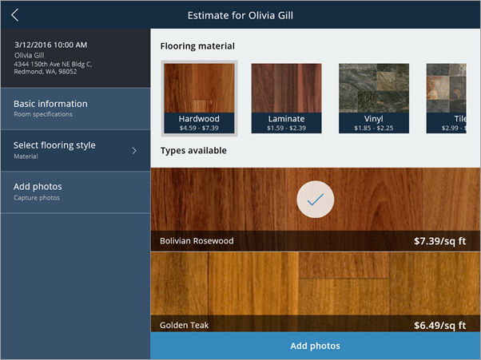
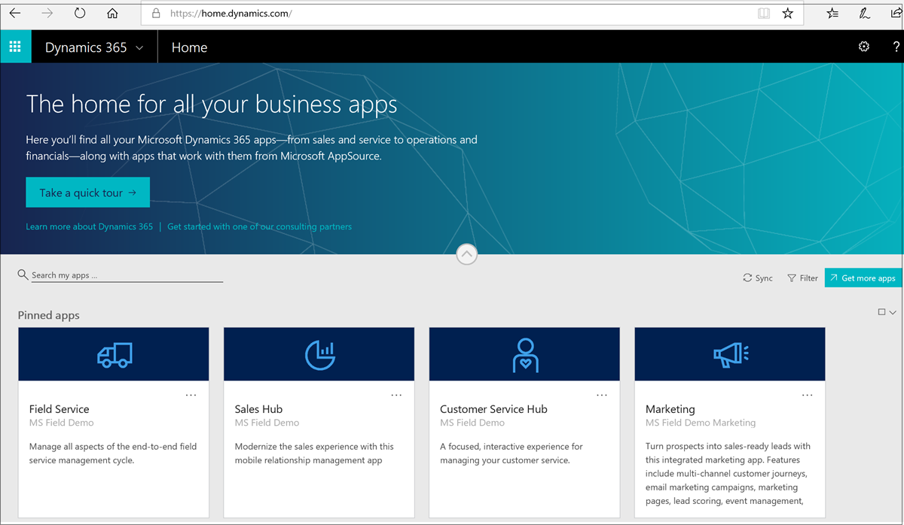

Now that you know the basics of Microsoft PowerApps, let's get to it. 
## Ways to build PowerApps
In this unit, we'll look at sample apps, creating apps from a template or by using shared apps, and creating apps from a data source. Then, in the next unit, we'll get more hands-on with app creation.

### Check out some sample apps
On web.powerapps.com, you'll be greeted with several sample apps that you can use in your web browser. Explore these apps to quickly get a sense of what's possible and how PowerApps can help your business.

Each sample app is designed for a specific purpose, like:

- Managing a budget.
- Inspecting a site.
- Tracking service tickets.

These sample apps also contain sample data to inspire your thinking. 

For example, the following app can help service representatives for a flooring company give accurate and immediate cost estimates when they visit customer locations.

### Create an app from a template
Another good way to create an app is to start from a template. Templates use sample data to help you get a sense of what's possible. And by opening them in PowerApps Studio, you can learn hands-on how an app is built.

For example, you can use the Budget Tracker template to create an app that helps you track the budget for projects and events, with custom categories, easy data entry, and visuals that highlight expenditures for easy inspection. Unlike sample apps, app templates let you explore the data source behind them, which is called a Common Data Service.

### Use shared apps
If your team has started using PowerApps, people might have shared apps with you already. Apps that people share with you show up in Microsoft AppSource. They also show up in Microsoft Dynamics 365 if an app developer chose to add them there. If you're a contributor to those apps, they also show up on web.powerapps.com.

### Create an app from a data source
A great way to get started is to generate an app from your own data. Just point PowerApps at the data source of your choice (for example, a Microsoft SharePoint list), and watch as PowerApps automatically builds a three-screen app. 

The following app was created from a SharePoint list. It lets you browse the list, view detailed records, and edit data. After PowerApps generates an app, you can  start customizing it to make it look and behave exactly the way you want. 

### Build from the ground up
You can also build applications from scratch and add all the pieces as you go. You can then branch out and let your imagination run wild. There will be plenty of that later in this module! 

But the easiest way to learn about PowerApps is to start with a sample app or a template, or to connect to your data source and have PowerApps generate the app for you. 

In the next unit, you'll learn how to generate an app from data.