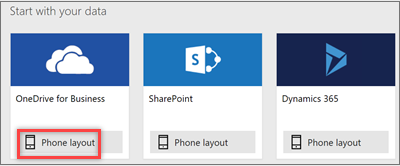

# Create your first app

OK, let's get started.

Now that you're familiar with all the parts of PowerApps and the options for creating apps, it's time to actually build an app. For this topic, we'll generate a phone app using a data source from an Excel spreadsheet on your OneDrive for Business account. Keep in mind that you could use data from lots of other sources, including SharePoint, cloud services like Salesforce, and on-premises sources such as SQL Server.

This spreadsheet lists a company's inventory of flooring samples, along with pictures and prices.

## Connect to a data source
1.  Download the [Flooring Estimates spreadsheet](https://pwrappssamples.blob.core.windows.net/samples/FlooringEstimates.xlsx) and save it to your OneDrive account.
1. Go to https://web.powerapps.com and sign in.
1. Select **Apps** on the left pane.
1. Select Create at app.
1. 1. Select **Phone layout** under **OneDrive for Business**.
1. Select **Create an app**.
1. For the **OneDrive for Business** data source, select **Phone layout**.

   

Generated apps are always based on a single list or table (you can add more data to the app later). The next three screens take you through the process of connecting to the the Excel spreadsheet.

8. Under **Connections**, select the OneDrive account where you upload the Excel spreadsheet.
9. Under **Choose an Excel file**, select the Excel spreadsheet.
10. Select **Connect**.

PowerApps now starts to generate the app. PowerApps makes all sorts of inferences about your data so that it generates a useful app as a starting point.

## Explore the generated app
Success! Your new three-screen app opens in PowerApps Studio. 

On the left, you'll see the **Screens** pane. Select an icon in the upper-right corner to switch to the thumbnail view. 

Select each thumbnail to view the controls on that screen. 

Below is the main PowerApps Studio development window, which you'll learn more about in the following topics.

Select the Play icon  in the top right to run the app. Play with app. You'll see that it includes all the data from the list and provides a good default experience.

All apps generated from data have the same set of screens that a app user works with:

* **Browse screen**: This is the main screen where you browse, sort, filter, and refresh the data pulled in from the data source. For the browse screen, you add items to the data source by select the plus (+) icon.
* **Edit/create screen**: This screen is where the app user edits  an existing item or creates a new one.
* **Details screen**: Select an item on the app and you'll see the details screen. This is where you can view more detail about an item, and can choose to delete or edit the item.

## Install the app on your device 
Of course you want to install your app and see how it looks on your phone.

1. If you have a phone, or a PC, download the PowerApps player app from the respective app store.
2. Sign in using your user name and password.
3. Run the Flooring estimates app on your mobile phone.
4. Otherwise, you can run the app from your Web browser.

Wow, that was pretty easy! In a few minutes you learned how to connect to a data source, generate an app, and get acquainted with PowerApps Studio and the three app screens. In later sections, you'll see how to customize generated apps.