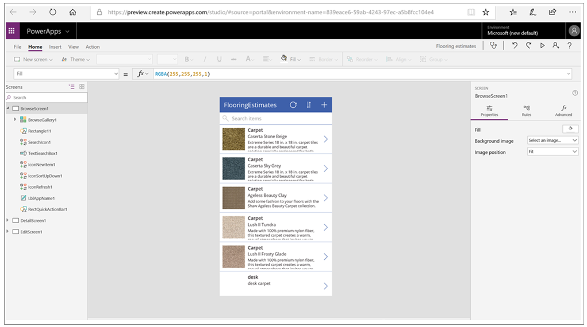

OK, let's get started.

Now that you're familiar with all the parts of Microsoft PowerApps and the options for creating apps, it's time to actually build an app. In this unit, you'll generate a phone app where the data source is a Microsoft Excel workbook that's stored on your Microsoft OneDrive for Business account. This Excel workbook lists a company's inventory of flooring samples, together with pictures and prices. 

But keep in mind that you can use data from lots of other sources, including Microsoft SharePoint, cloud services like Salesforce, and on-premises sources like Microsoft SQL Server.

## Connect to a data source
1.  Download the [Flooring Estimates spreadsheet](https://pwrappssamples.blob.core.windows.net/samples/FlooringEstimates.xlsx), and save it to your OneDrive for Business account.
1. Go to <https://web.powerapps.com>, and sign in.
1. In the left pane, select **Apps**.
1. Select **Create an app**.
1. For the **OneDrive for Business** data source, select **Phone layout**.

    

    Generated apps are always based on a single list or table (but you can add more data to the app later). The next three pages take you through the process of connecting to the Excel workbook.

1. Under **Connections**, select the OneDrive for Business account where you uploaded the Excel workbook.
1. Under **Choose an Excel file**, select the Excel workbook.
1. Select **Connect**.

PowerApps now starts generating the app. PowerApps makes all sorts of inferences about your data to generate a useful app as a starting point.

## Explore the generated app
Success! Your new three-screen app opens in PowerApps Studio. 

On the left, you'll see the **Screens** pane. In the upper right of the screens pane select the thumbnail view. 

Select the thumbnail for each screen to view the controls on that screen. 

Here is the main PowerApps Studio development window, which you'll learn more about in later units.

Select **Play**  in the upper right to run the app. Try out the app. You'll see that it includes all the data from the list and provides a good default experience.

All apps generated from data have the same set of screens that an app user works with:

* **Browse screen**: This is the main screen where you browse, sort, filter, and refresh the data pulled in from the data source. For the browse screen, you add items to the data source by selecting the plus sign (**+**).
* **Edit/create screen**: This screen is where the app user edits an existing item or creates a new one.
* **Details screen**: Select an item in the app, and you'll see the details screen. This screen is where you can view more details about an item, and can also delete or edit the item.

## Install the app on your device 
Of course, you'll want to install your app on your phone to see how it looks there.

1. Download the PowerApps player app from the appropriate app store, depending on whether you have a phone or a PC.
2. Sign in by using your user name and password.
3. Run the Flooring estimates app on your phone. Or, if you're using a PC, run the app from a web browser.

Wow, that was pretty easy! In just a few minutes, you learned how to connect to a data source and generate an app, and got acquainted with PowerApps Studio and the three app screens. In later units, you'll learn how to customize generated apps.