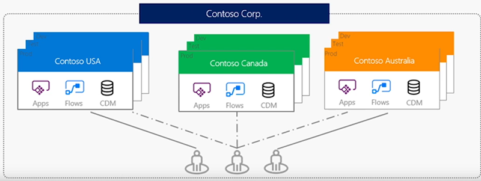
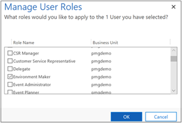

An environment is a container for apps and other resources, like data connections and flows from Microsoft Flow. It's a way to group things based on business requirements.

If you've followed along with this module so far, you've spent some time working on web.powerapps.com. Whether you knew it or not, you've been working in a specific environment the whole time.

In the upper-right corner of the web.powerapps.com home page, you can see your current environment.

If you're new to Microsoft PowerApps, you might have only the default environment at this point.

- Select the menu to see if other environments are available.

## Why use environments?
There are several reasons to create environments beyond the default one:

- **Separate app development by department**: In a large organization, each department can work in a different environment. That way, department employees see only apps and company data that are appropriate to their needs.
- **Support application lifecycle management (ALM)**: Separate environments let you separate apps that are in development stages from those that have already been shared. Or maybe you want a trial environment so that you can gain feedback from employees before rolling out the final app. For some organizations, showing apps before they're completely developed and published can present security concerns.
- **Manage data access**: Each environment can have its own source of business data, called a  database for Common Data Service for Apps. Other data connections are specific to an environment and can't be shared across environments.

> [!NOTE]
> Keep in mind that environments are relevant only to app creators and PowerApps admins. When you share an app with users, those users just run the app, provided that they have the correct permissions. They don't have to worry about what environment the app came from.

## Create an environment

Only an admin can create environments. If you aren't an admin, this information can still be helpful when you talk to your admin about setting up environments.

1. On the web.powerapps.com home page, select the gear symbol on the right, and then select **Admin center**.

    You can also go directly to admin.powerapps.com.

2. In the PowerApps admin center, select **New environment**. 
3. In the **New environment** dialog box, enter a name for the environment, and select a region and the environment type.
4. Select **Create environment**.

That's it. You now have a new environment to work in. If you go back to web.powerapps.com, you'll see it in the environments list.

## Manage access to an environment

Two types of people in an organization have access to an environment:

- **System admin**: A system admin has full permissions to create and manage environments.
- **Environment maker**: An environment maker can see all apps in that environment, create apps, and work with Common Data Service for Apps (other permissions apply).

1. Select the **Environments** tab on the left.
2. Select an environment.
3. Enter the email address of the person you want to assign a role to.
4. Select **Add User**.
5. Select **Assign security roles**.

    The Microsoft Dynamics 365 user management center appears.

6. Select the new name.
7. Select **Manage Roles** on the toolbar.
8. In the **Manage User Roles** box, select the types of roles for the user. In the following example, the user has been assigned the Environment Maker role.

    

9. Select **OK**.

This unit explained what the benefits of environments are, how to create them, and how to grant access to them. Even if you aren't an admin, it can be helpful to know how this works.