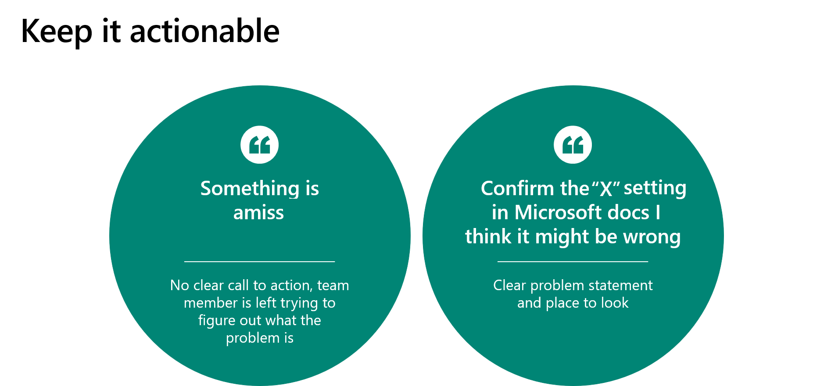

Often, a solution architect's role in the project will be to use their experience and expertise to evaluate issues and changes. However, monitoring change in a project is excessively simple, especially in Power Platform. Consequently, the solution architect could become overly focused on monitoring change rather than ensuring that the project moves forward. Therefore, the solution architect should guide other project team members in performing evaluation and analysis of issues and changes.

One challenge that new solution architects face is the process of leaving the role of doer into a role of leading and guiding others. A solution architect needs to be available to other project team members and to support their growth.

## Involvement in defining governance

With Power Platform projects, making changes can be simple; however, making several small changes and having a poor governance process can cause a project to fail. For instance, the solution architect needs to make sure that the process to evaluate change doesn't take longer than implementing the change.

It is imperative that the solution architect is involved in defining the processes and procedures for project governance. Their involvement helps ensure that processes and procedures are appropriate for the Power Platform technologies that are used and that they don't cause unnecessary overhead.

## Provide actionable feedback

The solution architect is often the intermediary between the customer and team members. Therefore, they need to provide feedback to both parties. Primarily, feedback should be provided to help shape the solution.

Feedback can happen as early as the creation of the request for proposal (RFP)/statement of work (SOW). However, feedback should be performed on an ongoing basis throughout the project.

The solution architect is responsible for ensuring that feedback is constructive and actionable.

## Handle bad news

Occasionally, the solution architect provides feedback about an issue that might not be well-received. Bad news does not improve with time. The solution architect must acknowledge and share bad news early in the process.

Examples of bad news that the solution architect shouldn't withhold:

- The cost of user licenses will increase by 87 percent if they move ahead with that requirement as written.
- That feature is being deprecated.
- With the added relationship, the data import will now take 30 days.
- Data migration has identified 200 new columns and, from this data, three new undocumented processes have been discovered.

> [!div class="mx-imgBorder"]
> 

The solution architect needs to ensure that feedback, especially bad news, is actionable. Stating that "Something is amiss" is pointless because it provides no clear call to action and the recipient is left trying to figure out what the issue might be. Instead, the solution architect should construct a clear problem statement and then provide references and the potential impact on the project.

Consider projects that you have been involved in, and then recall how bad news was handled and what effect it had on the project.

## Help people reach the same conclusion

Though the solution architect might have the most expertise, you need to help the project team members and customer reach the resolution to an issue. Stating, "That won’t work" will likely cause someone to feel defensive. The solution architect should always be constructive and avoid saying "No" too often. Instead, offer options or negotiate the requirements.

You should ask leading questions such as "Will that cause 1,000,000 Power Automate cloud flows to be run with that configuration?" Asking a leading question will encourage the person to think about the impact of their proposal. Remember, the person might not have the overall view of the project that the solution architect has.

If you have concerns about a proposed solution or a change, you need to highlight your concern but encourage the person to think through and resolve the concern.

Reviewing the work of others is a key task for the solution architect. The difference between reviewing what someone has done and doing the work yourself is minuscule. When reviewing the work of others, the solution architect needs to be constructive and provide suggestions on where to look for answers. For example, when it is unclear that a solid design has been proposed, the solution architect might encourage the creation of a proof of concept or other tests to validate the proposed solution.

Essentially, the role of a solution architect is to constantly talk to the people who are involved in the project to ensure that the vision of the project is achieved. Unsuccessful solution architects hide from the team and spend time updating their architecture designs rather than collaborating with the team and helping them discover solutions.

The next unit describes the techniques that a solution architect can use on a project.
