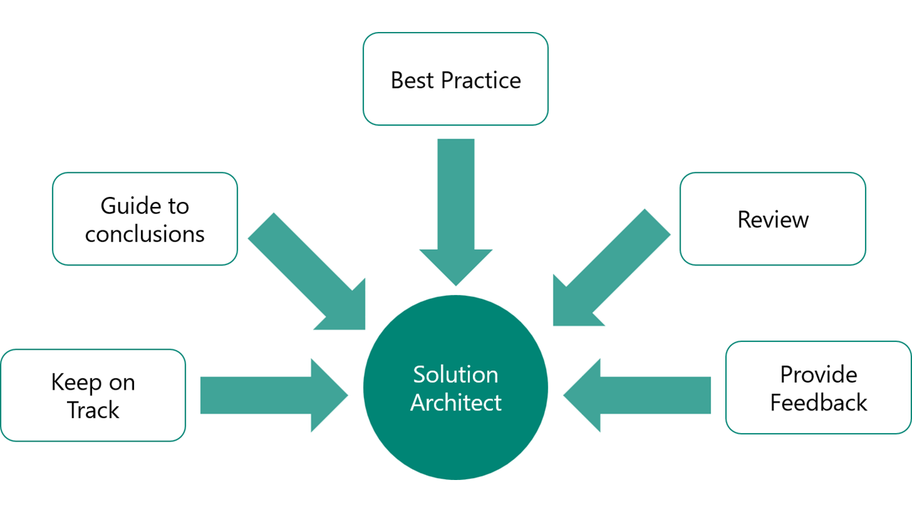

The solution architect will generally be the most experienced person on a project and might be the most skilled in many tasks in a project. However, a solution architect can't do everything alone. The solution architect needs to break down the work and delegate it to the most appropriate team member.

Essentially, the solution architect owns the overall vision of the project's technical solution and needs to communicate that vision to the team. 

## Be a role model

In any project, the solution architect is visible to other team members and will naturally be seen as a role model. The engagement manager and project manager lead the project; however, the solution architect is considered the "real" leader and can set the tone and pace for how the team works. Therefore, the solution architect is responsible for setting an example for others to follow.

Furthermore, the solution architect might be responsible for increasing the skills and experience of project team members, mentoring them, and encouraging them to take more responsibility and gain new skills.

## Assess team skills

A solution architect establishes the breakdown that will be used for the functional and technical design. As a solution architect, you seldom get to choose your team, and not everyone on a team can be a top performer.

The solution architect must learn how to assess team members' skills and weaknesses to assign the correct tasks to the correct team members. Solution architects shouldn't ask for a resume to gauge how much a specific team member knows about Power Platform. However, they should have a set of probing discussion questions to test knowledge, such as asking the team member when they should use managed instead of unmanaged solutions or when they should use business rules or Power Automate cloud flows.

The solution architect could also assign small tasks or proof of concepts to team members and then assess the results. Additionally, the solution architect should encourage the team member to explain their proposed solution to better understand their thought processes. 

The solution architect could create a skills matrix as the project evolves to enable a project to apply the strengths of the team to succeed.

## Stay congruent

The solution architect often brings considerable knowledge and experience and is usually the person on the team who sees the broader view. The solution architect should not assume that everyone else has the same skills, knowledge, experience, or understanding of the project.

Making assumptions and generalizations can be risky. A key role of the solution architect is to communicate the information to team members at the right time. Communication should be clear and relevant to each team member. Emails might not be sufficient, so the solution architect should talk regularly with team members to make sure that everyone is in congruence. Remember, communication is mutual, so it's important to listen to team members.

> [!div class="mx-imgBorder"]
> 

## Break down the work

A typical task for solution architects is to divide work and assign it to team members. The solution architect should look for logical divisions of functionality in the application, such as Customer Service versus Customer Acquisition. The solution architect should look for horizontal solution features such as document management or computer telephony integration (CTI).

## Establish standards

Standards are important on any project for the team to follow. Some elements in Power Platform are more difficult to change later, such as the schema prefix or table and column names.

The solution architect should define standards to ensure consistency for the following elements:

- Naming of components
- Column data types
- UI - The options for form layouts, when to use multiple forms, and so on
- Automation - When to use different automation options such as Power Automate cloud flows versus Classic workflow versus Business rules versus Client script
- Security - When to use roles, column security, hierarchical security, and so on
- Development - For example, define early versus late bound, error handling, and so on

The solution architect should use Microsoft documentation such as [model-driven apps best practices](https://docs.microsoft.com/powerapps/developer/model-driven-apps/best-practices/?azure-portal=true), [app design best practices](https://docs.microsoft.com/powerapps/developer/data-platform/appendix-app-design-best-practices-checklist/?azure-portal=true), and [developer best practices](https://docs.microsoft.com/dynamics365/customerengagement/on-premises/developer/best-practices-sdk/?azure-portal=true).

## Work environments

The solution architect is responsible for defining how configuration and development will occur. This definition will depend on many factors, including the skills of the team and whether the team is colocated or if they're dispersed remotely.

The development environment topology needs to be determined and some type of testing environment(s) will be needed. Remember, Power Platform does not provide version-controlled tracking by default.

Consider projects that you have been involved in, and then ask yourself what else the solution architect might have done to help teams work better together.
