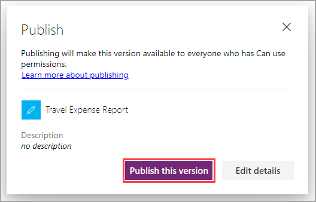

After you have saved your application, you can publish and share it. However, you might be curious about the differences and/or what it means when your app is saved versus published. When you save your app, it ensures that you don't lose the work that you have done, as you would expect. Keep in mind that saving your changes will not affect the published app version that your users are currently running. To introduce your latest app changes, you need to publish the app. You could consider saving as similar to a draft, and when you publish, your changes will be pushed out, making them live. This status doesn't mean that your app is complete, only that it has reached a new stage.

In this module's example, you have yet to publish the **Travel Expense Report** app, which is the task that you'll complete in this unit. Start by following these steps:

1. In your browser, go to [http://make.powerapps.com](http://make.powerapps.com/?azure-portal=true).

1. Select **Apps** on the left.

1. Locate your app and then select the ellipses (**...**) to the right of the app. Select **Edit**.

1. From the menu bar, in the upper-left corner, select **File > Save**.

1. After the app is saved, select **Publish**.

    > [!div class="mx-imgBorder"]
    > 

1. In the subsequent dialog, select **Publish this version**.

    > [!div class="mx-imgBorder"]
    > 

Now, you have successfully published your app and are ready to share it with users for testing and feedback. The button on the app will now show as **Share**, which will help guide you through the development process. Selecting **Share** will open a new tab, where you can manage the sharing permissions for this app. You can select the button if you want to view the permissions, but you'll also need to manage the sharing permissions for this app without publishing changes. In the next unit, you will learn how to access the sharing permissions for your app another way.
