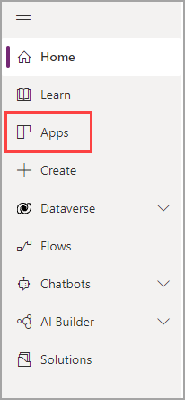
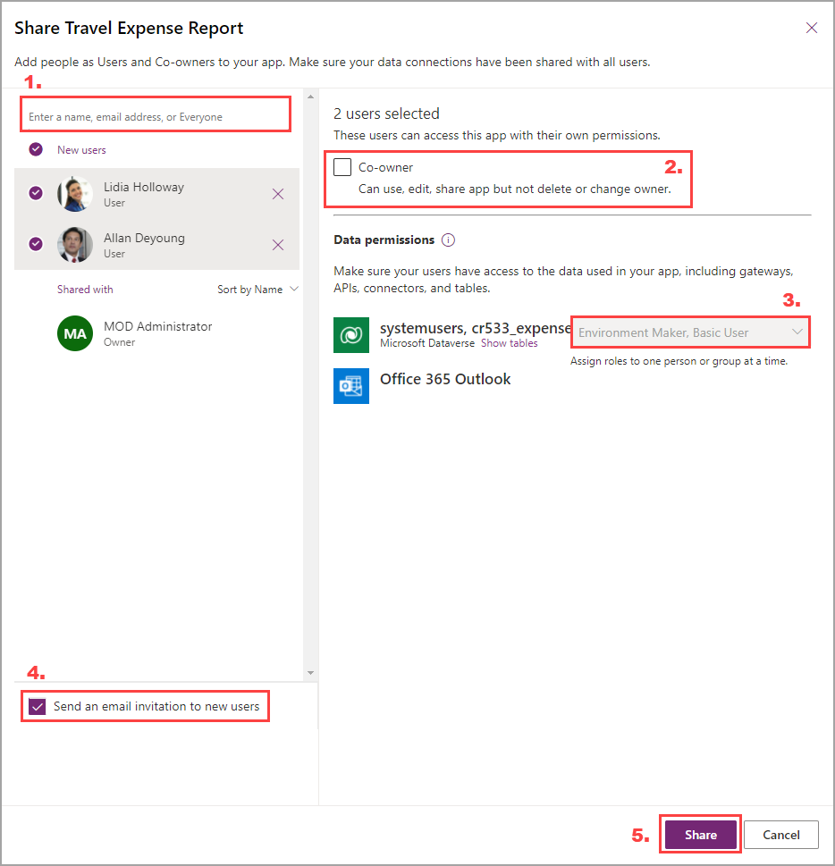

Once you've successfully published your app, it's time to share it out so users can begin testing the app.

1. Navigate to [http://make.powerapps.com](http://make.powerapps.com/?azure-portal=true). You should see your app listed at the bottom of the screen, but if you don't, select **Apps** in the navigation menu.

    > [!div class="mx-imgBorder"]
    > 

1. Find your app and select the ellipses "**...**" beside it. In the menu that pops out, select **Share**.

    > [!div class="mx-imgBorder"]
    > 

A sharing flyout menu will appear and before you just start adding/editing users, there are several important details or options to make note of.

> [!div class="mx-imgBorder"]
> 

1. You can add users from your active directory by typing their name or email address in the box. Selected users will appear below so you can add many at once.

1. If the **Co-owner** checkbox is selected, users will be able to make changes to your app. They will not be able to delete the creator of the app who is the owner. Each app will likely only have one or two developers and the remainder will be added simply as Users.

1. If you're adding only one person or group and using Dataverse as a data source, you can set user roles so that app users can make changes to the underlying data. No matter your data source, it is important that users have the proper roles or permissions to action on data.

1. If the **Send an email invitation to new users** checkbox is selected, an email will be sent to users with a link to access the application.

1. The **Share** button is self-explanatory, it shares the app with your users and also enacts any changes you made to other users permissions.

    Take a few moments and share the app with some users in your organization.

1. When you're done adding users, select **Share** and then close the flyout menu.

    Let's say you accidentally shared it with someone or just need to remove a user(s) permission, how do you remove them? See steps below:

1. Still on the App Details screen, select **Share**.

    > [!div class="mx-imgBorder"]
    > 

1. You can select the user or simply hover over their name and then select the **X** icon.

    > [!div class="mx-imgBorder"]
    > 

1. At the bottom, select **Share**, to save your updated sharing permissions.

In addition to adding users one by one, you can type 'Everyone' to share with every user in your tenant.

Previously, when you were adding users to share the app with, if you left the checkbox selected for **Send an email invitation to new users** and was curious as to what the email looked like, see below:

> [!div class="mx-imgBorder"]
> 

If you unchecked the box for **Send an email invitation to new users**, what happens then? Is there a way to still send the users a link to the App? Yes, you can actually find the link for your app on the App Details screen. The link to access your app is called the **Web link**.

> [!div class="mx-imgBorder"]
> 

But remember, the app still has to be Shared with any user(s) you want to have access. If you were to send someone the link to your app and they've not been given access from the sharing flyout, they'll get a generic permission/access error message.

> [!div class="mx-imgBorder"]
> 

Your app has been shared and the users who have access can begin testing. In the next section, you will learn how to maintain your app.
