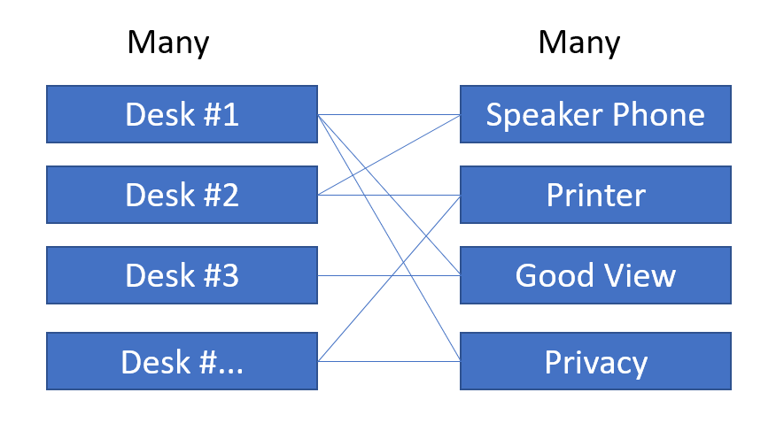
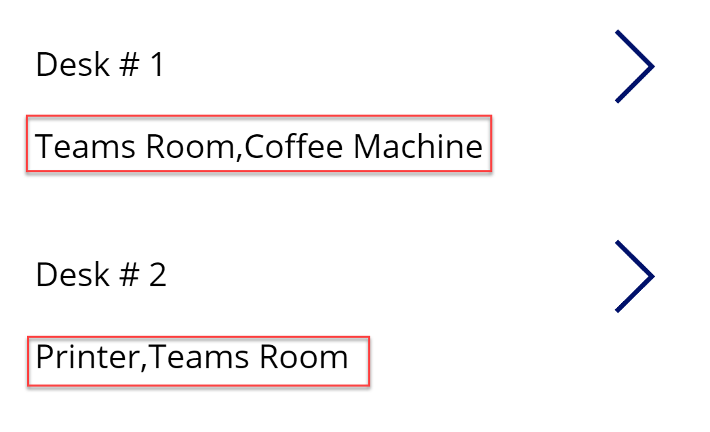
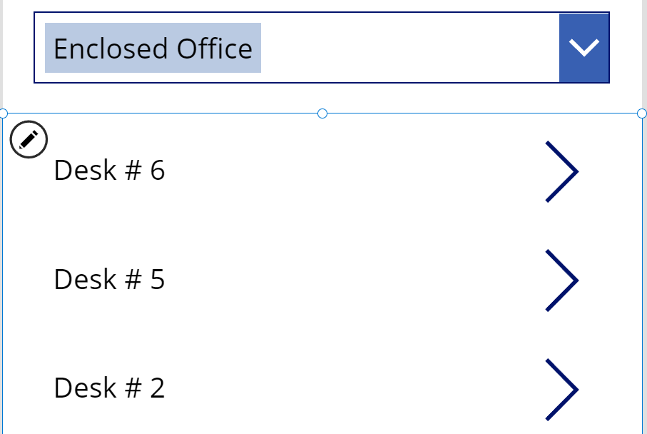

Many-to-many relationships provide you with the flexibility to track when multiple rows have the same related data. Unlike one-to-many relationships, many-to-many relationships don't have a concept of a primary table. The relationship is entirely symmetrical, and you can access the set of related rows, starting from either side of the many-to-many relationship. To continue with the Contoso workspace-sharing data model, the following sections explore how to work with many-to-many relationships in a canvas app by using the **Desk** and the **Desk feature** items. The following diagram illustrates the relationship and the corresponding data.

> [!div class="mx-imgBorder"]
> 

Each desk can have multiple associated desk feature rows, and you can associate each desk feature with multiple desks. You could access the set of desk features from a desk row by using the **ThisItem.'Desk Features'** expression. From the desk features row, you can use the **ThisItem.Desks** expression to access all desks that are associated with that specific desk feature.

You could use this expression to show a comma-separated list of values for each desk in a gallery, as shown in the following example.

> [!div class="mx-imgBorder"]
> 

To accomplish the task of populating the label text, set the **Text** property on the label to the following formula:

`Concat(ThisItem.'Desk Features',Name ,",")`

Be aware of performance implications when you use this formula, especially if you have many records, because of how the data is accessed from Dataverse. The following image shows that, from the monitor, one call to **getRows** is completed to get the list of desks. For each desk, a call to **getNavigatedRowInTableRow** is made to retrieve the desk features.

> [!div class="mx-imgBorder"]
> 

Alternatively, you might find it more beneficial to only show the desk features after the user has selected a single desk row in a gallery or after they've drilled down into the details of the desk row.

Another way to use the relationship is to allow a user to pick a desk feature and then use the **controlName.Selected.Desks** property to populate items in a gallery.

> [!div class="mx-imgBorder"]
> 

This approach works well when you only allow a single selection in the combo box. If you enable multiple selections, the logic gets more complex. Currently, Power Fx does not have a simple way to express an intersection of two collections, which is required to make the scenario work. Workarounds are possible, for example, you could iterate through all selected features, collect related desks in a single collection, remove the duplicates, and then use the collection as the item's source. However, because of the multiple Dataverse requests (one for each selected feature), the performance of this approach will quickly degrade as the tables grow.

## Establish the relationship

The primary way to establish a many-to-many relationship is to use the Relate() function, similar to how you would with a one-to-many relationship. The main difference is that it doesn't matter which record is the first or second parameter to Relate() because no primary table is in the relationship.

Managing many-to-many relationships on a form is more complex than many-to-one lookup columns. The many-to-many relationship is available in the fields list; however, when you add the field to the form, the system doesn't generate the formulas for the control to work, and you will receive an error similar to the following example.

> [!div class="mx-imgBorder"]
> 

To resolve the issue, update the Choices() function in the **Items** property for the table that is on the other side of the many-to-many relationship. To accomplish that task, unlock the card from the **Advanced** tab.

> [!div class="mx-imgBorder"]
> 

In the Contoso example, you want to use desk features. After you unlock the control, verify that the **Items** property shows **'Desk Features'** as the data source.

> [!div class="mx-imgBorder"]
> 

> [!NOTE]
> The preceding scenario uses the form to add a row. To support the edit capabilities, make sure that you change the **DisplayMode** property for the card from the default **View** setting to **Edit**.

After you have adjusted the properties, the form user interface will work, and you can choose items from the combo box. However, if you attempt to submit the form, you will receive an error similar to the following example.

> [!div class="mx-imgBorder"]
> 

To work around the issue, clear the **Update** property and manually process the many-to-many association after the form is submitted.

> [!div class="mx-imgBorder"]
> 

After you have cleared the **Update** property, the form submission will work. However, the relationships between the Desk and the Desk Feature table rows will not be created. To establish the relationships, add the following logic to the **OnSelect** property of the check icon that is used to submit the form by default:

1.  Save the desk features that are selected in the combo box as a collection. This step is required because the form submission will reset the fields, and the value will be lost.

1.  Submit the form.

1.  Use the saved collection of the desk features to establish the relationship.

> [!div class="mx-imgBorder"]
> 

## Other design options

User experience with many-to-many relationships is similar to experiences where the Choices column is used. Choices values are predetermined by the maker, and they can't be disabled or secured. For that reason, Choices fields are suitable for scenarios with rarely modified data, such as a list of countries. Moreover, rows in the related tables can be deactivated, secured, and added at run time. That ability makes a many-to-many relationship a good option in scenarios where some flexibility is needed at runtime, such as when you are tagging a solution where the contact has a many-to-many relationship with a tag and tags need to be added by the users.

Many-to-many relationships are beneficial for situations where you want to capture the association between rows of two tables. The relationship between the rows can't store other data. For example, if you had a relationship between a Contact and a Language table, you could track that a person speaks two languages.

> [!div class="mx-imgBorder"]
> 

However, you would not know how long the person has spoken each language and how proficient they are at speaking it.

A common alternative design pattern is to create your own intersect table. The following Language Spoken table is another custom Dataverse table. You can add columns to this table for any other properties that describe the specific relationship. Then, this new table will have N:1 relationships to Contact and Language.

> [!div class="mx-imgBorder"]
> 

Working with these tables from your application is similar to working with any other tables that have one-to-many or many-to-one relationships. Because an extra table is involved, you might discover that some extra logic will be required to ensure a smooth user experience. It is important to understand the requirements of your application and to know if a many-to-many relationship needs to track other data, especially considering that you need to make this decision at the time when the tables are related.
