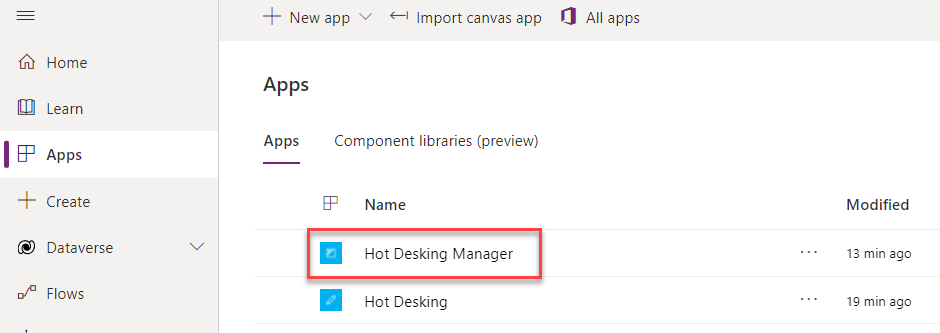
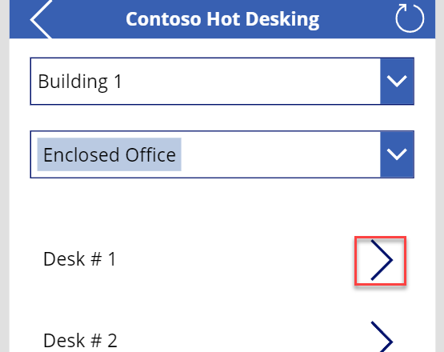
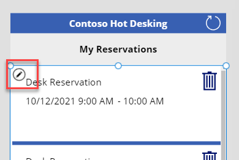

Contoso, like many companies, has multiple locations and allows employees to work from home. Occasionally, these employees need to come into the office and need a desk to use during their visit. Previously, Contoso had their employees show up and walk around to find an available desk. They built a Power Platform solution that the employees can use to see in advance what desks are available and reserve one.

In this exercise, you will be making some enhancements to the Power Apps canvas app.

## What you will learn

- How to work with one-to-many and many-to-one relationships

- How to work with many-to-many relationships

## Prerequisite:

- You will need an environment with Microsoft Dataverse.

## Exercise 1: Import solution

In this exercise, you will import a starting solution into your test environment and load some sample data using a Power Automate cloud flow. This solution contains five tables, one canvas application, one model-driven application, and one cloud flow.

### Task 1: Import the starting solution

In this task, you will import a solution into your environment.

1.  Navigate to [Power Apps maker portal](https://make.powerapps.com/?azure-portal=true) and select the environment you would like to use for this lab.

1.  Select **Solutions** and select **Import**.

	> [!div class="mx-imgBorder"]
	> 

1.  Select **Browse**.

1.  Browse to the lab resources folder, select the ContosoHotDesking_1_0_0_0.zip solution, and select **Open**.

1.  Select **Next**.

1.  Select **Next** again.

1.  Select the select a connection dropdown and select **+ New connection**.

	> [!div class="mx-imgBorder"]
	> 

1.  Select **Create**.

1.  Provide your credentials.

1. Close the connections browser window or tab.

1. Select **Refresh**.

1. Select **Import** and wait for the solution importing to complete.

### Task 2: Load sample data

In this task, you will run a cloud flow that will create some sample data for you.

1.  Select **Solutions** and select to open the **Contoso Hot-desking** solution you imported.

1.  Select **Cloud flows** and select to open the **Load Sample Hot Desk Data** flow.

	> [!div class="mx-imgBorder"]
	> 

1.  Select **Run**.

1.  Select **Run flow**.

1.  Select **Done** and wait for the flow run to complete. Select the refresh button to see the flow run status, you should see Succeeded status when the flow run completes.

	> [!div class="mx-imgBorder"]
	> 

### Task 3: Run apps

In this task, you will run the manager application and the hot-desking applications to get familiar with them and finish setting up the data.

1.  Navigate to [Power Apps maker portal](https://make.powerapps.com/?azure-portal=true) and select the environment you are using for this lab.

1.  Select **Apps** and select to launch the **Hot-desking Manager** application.

	> [!div class="mx-imgBorder"]
	> 

1.  Select **Desks** and make sure you have sample data.

1.  Select **Locations** and make sure you have sample data.

1.  Select Desk **Features** and make sure you have sample data.

1.  Select **Locations**, select three locations, and select **Edit**.

	> [!div class="mx-imgBorder"]
	> 

1.  Select your user for **Primary contact** and select **Change**.

	> [!div class="mx-imgBorder"]
	> 

1.  Close the Hot-desking Manager application.

1.  Make sure you still have **Apps** selected, select the **Hot-desking** application, and select **Edit**.

	> [!div class="mx-imgBorder"]
	> 

1. The application should open in app studio.

1. Select the **HomeScreen** and select **Play**.

1. Select **New Reservation.**

1. Select **Building 1**, select **Enclosed Office**, and select **Desk \# 1**.

	> [!div class="mx-imgBorder"]
	> 

1. Select a future data and select **Book** for **9:00**.

1. Select **New Reservation** again.

1. Select **Building 2**, select **Teams Room**, and select **Desk \# 2**.

1. Select a future data and select **Book** for **13:00**.

1. Add a few more reservations with different combination.

1. You should now have at least four reservations. Close the preview.

	> [!div class="mx-imgBorder"]
	> 

1. Expand the **ReserveDeskScreen**, expand **Gallery3**, and select **Button1**.

	> [!div class="mx-imgBorder"]
	> 

1. Go the formula and review the formula for **OnSelect**. When Book is selected by the user, a Patch function is used to create a new Reservation row. This new row has relationships to both the desk and your user. The user relationship is set from a global variable that is established in the app on start.

	> [!div class="mx-imgBorder"]
	> 

1. You may review other formulas in the application to become familiar with how it works.

1. Select the **Back** button after you are done reviewing the formulas.

	> [!div class="mx-imgBorder"]
	> 

1. Do not navigate away from this page.

## Exercise 2: Create relationship

In this exercise, you will create a relationship for favorite desks. This relationship will be a many-to-many relationship between the User and Desk tables. This will allow us to implement a feature where a user can tag a desk as a favorite.

### Task 1: Create relationship

1.  Expand **Dataverse** and select **Tables**.

1.  Search for desk and select to open the **Desk** table.

	> [!div class="mx-imgBorder"]
	> 

1.  Select the **Relationships** tab, select **+ Add relationship**, and select **Many-to-many**.

	> [!div class="mx-imgBorder"]
	> 

1.  Select User for **Related (Many) Table** and select **Done**.

1.  Select **Save table**.

1.  Select **Solutions** and select **Publish all customizations**.

1.  Wait for the publishing to complete.

## Exercise 3: Add info to reservation display

In this exercise, you will change the reservation gallery to show reservations created by the current user instead of showing all the reservations. You will also show more information on the reservation list.

### Task 1: Edit application

In this task, you will edit the Contoso product manager application.

1.  Navigate to [Power Apps maker portal](https://make.powerapps.com/?azure-portal=true) and select the environment you are using for this lab.

1.  Select **Apps**, select the **Hot-desking** application, and select Edit.

	> [!div class="mx-imgBorder"]
	> 

1.  Expand the **HomeScreen** and select **Gallery5**.

1.  Go to the formula bar and change the **Items** formula to the formula below. This formula will filter for reservation associated with current user. This uses the one-to-many relationship between the user and reservation table.

	`LookUp(Users,'Primary Email'=currentUserEmail).'Reservations (contoso_Reservation_ReservedFor_SystemUser)'`

	> [!div class="mx-imgBorder"]
	> 

1.  Select the edit gallery icon.

	> [!div class="mx-imgBorder"]
	> 

1.  Go to the **Insert** tab and select **Label**.

	> [!div class="mx-imgBorder"]
	> 

1.  Select the label you just added to the gallery and change the **Text** value to the formula below. This uses the one-to-many relationship between the reservation and desk tables.

	`ThisItem.Desk.Name`

1.  Resize and reposition the label.

	> [!div class="mx-imgBorder"]
	> 

1.  While still in edit mode select to add another **Label**.

1. Select the label you just added and set the **Text** value to the formula below. The following shows using two levels deep in the relationships, starting from the reservation and using Desk to get the Location.

	`ThisItem.Desk.Location.Phone`

1. Resize and reposition the label.

	> [!div class="mx-imgBorder"]
	> 

1. While still in edit mode select **Label** one more time.

1. Select the label you just added and set the **Text** value to the formula below.

	`If(IsBlank(ThisItem.Desk.Location.'Primary Contact'),"No Primary Contact",ThisItem.Desk.Location.'Primary Contact'.'Full Name')`

1. Resize and reposition the label.

1. The Reservation gallery should now look like the image below.

	> [!div class="mx-imgBorder"]
	> 

1. Select **File** and select **Save**.

1. Select the back button.

1. Do not navigate away from this page.

## Exercise 4: Add favorite desk

In this exercise, you add an icon that will let users select favorite desks. You will also add a label that will show desk features.

### Task 1: Add favorite

1.  Expand the **FindDeskScreen** and select **GalleryDesks**.

1.  Select the **Edit** gallery icon.

	> [!div class="mx-imgBorder"]
	> 

1.  Go to the Insert tab, select Icons and select one of the icons. We will set the specific icon in the next step using a formula. So, for this step, it doesn't matter which icon you use.

1.  Select the icon you just added and change the Icon value to the formula below. This formula will show the thumbs up filled if the user didn't favorite this desk or show thumbs up if the user already favorite the desk. 

> [!NOTE]
> The CountIf does encounter [delegation](/powerapps/maker/canvas-apps/delegation-overview/?azure-portal=true) challenges, if you have a large amount of rows in your app you might have to use an alternate approach.

	`If(CountIf(ThisItem.Users, ThisRecord.User = currentUser.User) > 0, Icon.ThumbsUp,Icon.ThumbsUpFilled)`

1.  Make sure you still have the icon selected. Select **OnSelect** and paste the formula below. This formula will relate or unrelate this desk and logged in user depending on whether the user already favorited the desk

	`If(CountIf(ThisItem.Users, ThisRecord.User = currentUser.User) > 0, Unrelate(ThisItem.Users, currentUser), Relate(ThisItem.Users, currentUser))`

1.  Reposition the icon in the gallery, as shown below.

	> [!div class="mx-imgBorder"]
	> 

1.  Make sure you are still in gallery edit mode. Go to the **Insert** tab and select **Label**.

1.  Select the label you just added and set the **Text** value to the formula below. This formula will concatenate the desk feature names. This uses the many-to-many relationship between desk and desk features tables.

	`Concat(ThisItem.'Desk Features', Name, " , " )`

1.  Resize and reposition the label to better fit the space.

1. Select **File** and **Save**.

1. Select the back button.

1. Select **Play** to preview the app.

1. The gallery should look like the image below. Select the like icon of one of the desks.

	> [!div class="mx-imgBorder"]
	> 

1. The icon should change to thumbs up. Select the icon again.

	> [!div class="mx-imgBorder"]
	> 

1. The icon should change back thumbs up filled. Select the icon again.

1. Close the preview.

1. Do not navigate away from this page.

## Exercise 5: Filter desks

In this exercise, you will add a filter to the desks gallery if the user selects a feature from the dropdown.

### Task 1: Filter for features

1.  Select GalleryDesks.

1.  Go to the formula bar and add the formula below to the formula for **Items**. This formula will filter the desks to show only desks that have the selected feature. Do not forget to include the comma.

	`,IsBlank(filterFeatures.Selected) || Desk in filterFeatures.Selected.Desks.Desk`

	> [!div class="mx-imgBorder"]
	> 

1.  Select **File** and **Save**.

1.  Select the back button.

1.  Select **Play**.

1.  Make a note of the desk features available for the selected building.

	> [!div class="mx-imgBorder"]
	> 

1.  Select a feature from the dropdown. You should only see desks that have the selected feature.

	> [!div class="mx-imgBorder"]
	> 

1.  Select different buildings and features to make sure the application behaves as expected.

1.  Close the preview.

1.  You may close the app designer.