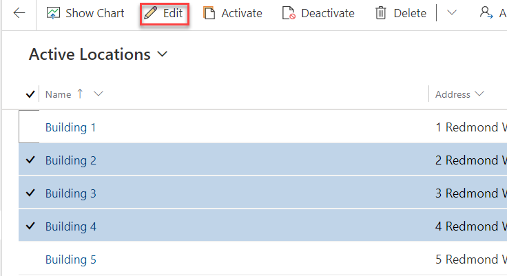
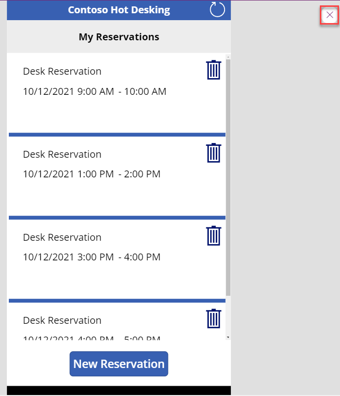
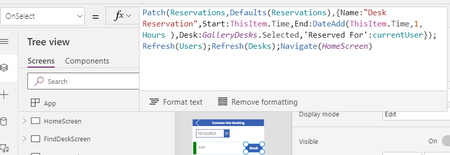
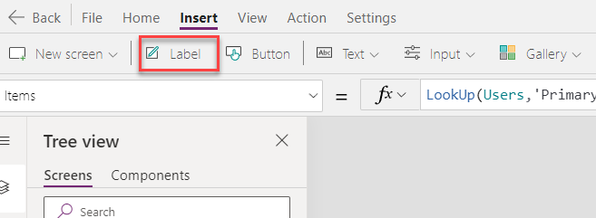
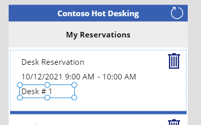
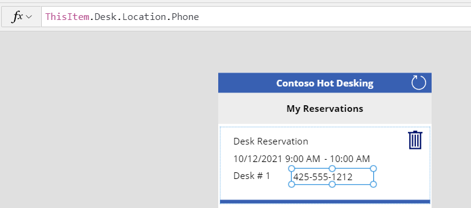
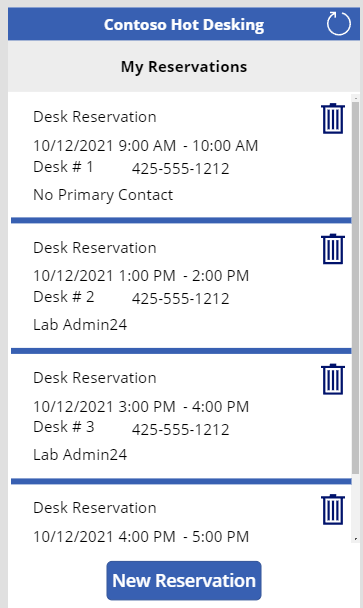
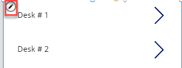
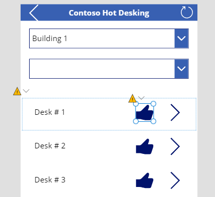

Contoso, like many companies, has multiple locations and allows employees to work from home. Occasionally, these employees need to come into the office and need a desk to use during their visit. Previously, Contoso instructed their employees to walk around the office location on arrival to find an available desk. The company has since discovered that this type of shared workspace system, or *hot desking*, has created challenges for IT support and licensing. As a result, Contoso has recently built a Microsoft Power Platform solution that will allow employees to view which desks are available and reserve one in advance.

In this exercise, you will be enhancing the canvas app from Power Apps.

## Objectives

The objectives for this exercise are for you to learn how to work with the following relationships:

- One-to-many and many-to-one

- Many-to-many

## Prerequisite

To complete this exercise, you will need an environment with Microsoft Dataverse.

## Exercise 1: Import a solution

In this exercise, you will import a starting solution into your test environment and then load sample data by using a Microsoft Power Automate cloud flow. This solution contains five tables, one canvas application, one model-driven application, and one cloud flow.

### Task 1: Import the starting solution

In this task, you will import a solution into your environment.

1. You will need to download the [zip file](https://github.com/MicrosoftDocs/mslearn-developer-tools-power-platform/blob/master/power-apps/relational-data/ContosoHotDesking_1_0_0_0.zip) to complete this exercise. Select download once the link opens.

1.  Navigate to [Power Apps maker portal](https://make.powerapps.com/?azure-portal=true) and select the environment you would like to use for this lab.

1.  Select **Solutions > Import**.

	> [!div class="mx-imgBorder"]
	> 

1.  Select **Browse**.

1.  Select the ContosoHotDesking_1_0_0_0.zip solution, and select **Open**.

1.  Select **Next**.

1.  Select **Next** again.

1.  In the **Select a connection** dropdown list, select **+ New connection**.

	> [!div class="mx-imgBorder"]
	> 

1.  Select **Create**.

1.  Provide your credentials.

1. Close the connections browser window or tab.

1. Select **Refresh**.

1. Select **Import** and then wait for the solution importing to complete.

### Task 2: Load sample data

In this task, you will run a cloud flow that will create sample data.

1.  Select **Solutions** and then select to open the **Contoso hot desking** solution that you imported.

1.  Select **Cloud flows** and then select to open the **Load Sample Hot Desk Data** flow.

	> [!div class="mx-imgBorder"]
	> 

1.  Select **Run**.

1.  Select **Run flow**.

1.  Select **Done** and then wait for the flow run to complete. Select the **Refresh** button to view the flow run status. A **Succeeded** status should display when the flow run completes.

	> [!div class="mx-imgBorder"]
	> 

### Task 3: Run apps

In this task, you will run the **Hot Desking Manager** and **Hot Desking** applications to become familiar with them. Then, you will finish setting up the data.

1. Go to the [Power Apps maker portal](https://make.powerapps.com/?azure-portal=true) and select the environment that you are using for this lab.

1.  Select **Apps** and select to launch the **Hot Desking Manager** application.

	> [!div class="mx-imgBorder"]
	> 

1.  Select **Desks** and then make sure that you have sample data.

1.  Select **Locations** and then make sure that you have sample data.

1.  Select **Desk Features** and then make sure that you have sample data.

1.  Select **Locations**, select three locations, and then select **Edit**.

	> [!div class="mx-imgBorder"]
	> 

1.  In the **Primary Contact** field, select your user and then select **Change**.

	> [!div class="mx-imgBorder"]
	> 

1.  Close the **Hot Desking Manager** application.

1.  Make sure that you still have **Apps** selected, select the **Hot Desking** application, and then select **Edit**.

   > [!div class="mx-imgBorder"]
   > 

   The application should open in app studio.

1. Select the **HomeScreen** and then select **Play**.

1. Select **New Reservation**.

1. Select **Building 1**, **Enclosed Office**, and **Desk \# 1**.

	> [!div class="mx-imgBorder"]
	> 

1. Select a future date and then select **Book** for **9:00**.

1. Select **New Reservation** again.

1. Select **Building 2**, **Teams Room**, and **Desk \# 2**.

1. Select a future date and then select **Book** for **13:00**.

1. Add a few more reservations with different combinations.

1. You should now have at least four reservations. Close the preview.

	> [!div class="mx-imgBorder"]
	> 

1. Expand the **ReserveDeskScreen** dropdown list, expand **Gallery3**, and then select **Button1**.

	> [!div class="mx-imgBorder"]
	> 

1. Go the formula and review the formula for **OnSelect**. When the user selects the **Book** option, a Patch() function is used to create a new **Reservation** row. This new row has relationships to the desk and your user. The user relationship is set from a global variable that is established in the app on start.

	> [!div class="mx-imgBorder"]
	> 

1. Review other formulas in the application to become familiar with how the process works.

1. Select the **Back** button after you are done reviewing the formulas.

	> [!div class="mx-imgBorder"]
	> 

1. Do not navigate away from this page.

## Exercise 2: Create a relationship

In this exercise, you will create a relationship for favorite desks. This relationship will be a many-to-many relationship between the User and Desk tables. This relationship will allow you to implement a feature where a user can tag a desk as a favorite.

### Task: Create a relationship

In this task, you will create a relationship for favorite desks.

1.  Expand **Dataverse** and select **Tables**.

1.  Search for and select the **Desk** table.

	> [!div class="mx-imgBorder"]
	> 

1.  Select the **Relationships** tab, select **+ Add relationship**, and then select **Many-to-many**.

	> [!div class="mx-imgBorder"]
	> 

1.  Select **User** for **Related (Many) Table** and then select **Done**.

1.  Select **Save table**.

1.  Select **Solutions** and then select **Publish all customizations**.

1.  Wait for the publishing process to complete.

## Exercise 3: Add information to a reservation display

In this exercise, you will change the reservation gallery to show reservations that have been created by the current user instead of showing all reservations. You will also show more information on the reservation list.

### Task: Edit the application

In this task, you will edit the Contoso product manager application.

1.  Go to the [Power Apps maker portal](https://make.powerapps.com/?azure-portal=true) and select the environment that you are using for this lab.

1.  Select **Apps**, select the **Hot Desking** application, and then select **Edit**.

	> [!div class="mx-imgBorder"]
	> 

1.  Expand **HomeScreen** and select **Gallery5**.

1.  Go to the formula bar and change the **Items** formula to the following formula. This formula will filter for a reservation that is associated with current user, and it uses the one-to-many relationship between the user and reservation table.

	`LookUp(Users,'Primary Email'=currentUserEmail).'Reservations (contoso_Reservation_ReservedFor_SystemUser)'`

	> [!div class="mx-imgBorder"]
	> 

1.  Select the edit gallery icon.

	> [!div class="mx-imgBorder"]
	> 

1.  Go to the **Insert** tab and select **Label**.

	> [!div class="mx-imgBorder"]
	> 

1.  Select the label that you added to the gallery and then change the **Text** value to the following formula. This formula uses the one-to-many relationship between the reservation and desk tables.

	`ThisItem.Desk.Name`

1.  Resize and reposition the label.

	> [!div class="mx-imgBorder"]
	> 

1.  While still in edit mode, select to add another **Label**.

1. Select the label that you added and set the **Text** value to the following formula. The following formula shows that you are using two levels deep in the relationships, starting from the reservation, and using **Desk** to get the **Location**.

	`ThisItem.Desk.Location.Phone`

1. Resize and reposition the label.

	> [!div class="mx-imgBorder"]
	> 

1. While still in edit mode, select **Label** one more time.

1. Select the label that you added and set the **Text** value to the following formula.

	`If(IsBlank(ThisItem.Desk.Location.'Primary Contact'),"No Primary Contact",ThisItem.Desk.Location.'Primary Contact'.'Full Name')`

1. Resize and reposition the label.

   The reservation gallery should now appear similar to the following image.

	> [!div class="mx-imgBorder"]
	> 

1. Select **File > Save**.

1. Select the **back** button.

1. Do not navigate away from this page.

## Exercise 4: Add a favorite desk

In this exercise, you will add an icon that will let users select favorite desks. You will also add a label that will show desk features.

### Task: Add a favorite

In this task, you will add a favorite desk and add a label to show desk features.

1.  Expand **FindDeskScreen** and then select **GalleryDesks**.

1.  Select the **Edit** gallery icon.

	> [!div class="mx-imgBorder"]
	> 

1.  Go to the **Insert** tab, select **Icons**, and then select one of the icons. You will set the specific icon in the next step by using a formula. Therefore, for this step, it doesn't matter which icon you choose.

1.  Select the icon that you added and change the **Icon** value to the following formula. This formula will show the **thumbs up** icon filled if the user didn't indicate this desk as a favorite, or it will show the **thumbs up** icon if the user has already selected the desk as a favorite. 

    > [!NOTE]
    > The CountIf does encounter [delegation](/powerapps/maker/canvas-apps/delegation-overview/?azure-portal=true) challenges, if you have a large amount of rows in your app you might have to use an alternate approach.

   `If(CountIf(ThisItem.Users, ThisRecord.User = currentUser.User) > 0, Icon.ThumbsUp,Icon.ThumbsUpFilled)`

1.  Make sure that you still have the icon selected. Select **OnSelect** and then paste the following formula. This formula will relate or unrelate this desk and signed-in user, depending on whether the user has already added the desk as a favorite.

	`If(CountIf(ThisItem.Users, ThisRecord.User = currentUser.User) > 0, Unrelate(ThisItem.Users, currentUser), Relate(ThisItem.Users, currentUser))`

1.  Reposition the icon in the gallery, as shown in the following image.

	> [!div class="mx-imgBorder"]
	> 

1.  Make sure you are still in gallery edit mode. Go to the **Insert** tab and select **Label**.

1.  Select the label that you added and set the **Text** value to the following formula. This formula will concatenate the desk feature names and uses the many-to-many relationship between the Desk and Desk Features tables.

	`Concat(ThisItem.'Desk Features', Name, " , " )`

1.  Resize and reposition the label to better fit the space.

1. Select **File > Save**.

1. Select the **back** button.

1. Select **Play** to preview the app.

1. The gallery should appear like the following image. Select the **thumbs up** icon of one of the desks.

	> [!div class="mx-imgBorder"]
	> 

1. The icon should change to thumbs up. Select the icon again.

	> [!div class="mx-imgBorder"]
	> 

1. The icon should change back to showing the **thumbs up** icon as filled. Select the icon again.

1. Close the preview.

1. Do not navigate away from this page.

## Exercise 5: Filter desks

In this exercise, you will add a filter to the desks gallery if the user selects a feature from the dropdown list.

### Task: Filter for features

In this task, you will add a filter for features.

1.  Select **GalleryDesks**.

1.  Go to the formula bar and add the following formula to the formula for **Items**. This formula will filter the desks to show only desks that have the selected feature. Don't forget to include the comma.

	`,IsBlank(filterFeatures.Selected) || Desk in filterFeatures.Selected.Desks.Desk`

	> [!div class="mx-imgBorder"]
	> 

1.  Select **File > Save**.

1.  Select the **back** button.

1.  Select **Play**.

1.  Note the desk features that are available for the selected building.

	> [!div class="mx-imgBorder"]
	> 

1.  Select a feature from the dropdown list. Only desks that have the selected feature should display.

	> [!div class="mx-imgBorder"]
	> 

1.  Select different buildings and features to make sure that the application behaves as expected.

1.  Close the preview.

1.  Close the app designer.
