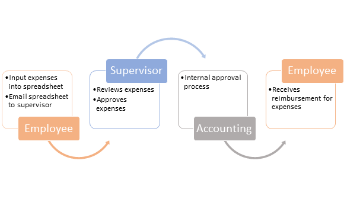

Contoso has been using an Excel workbook to track employee expenses. When an employee embarks on a business trip, they input their travel expenses into a spreadsheet and email the completed spreadsheet to their supervisor. Once the supervisor approves the expenses, the supervisor will pass the spreadsheet via email to the accounting department, which has its own internal approval process and finally, the employee will receive a reimbursement.

> [!div class="mx-imgBorder"]
> 

There are few issues that Contoso faces with this process. First, the process must be communicated with employees each time they travel as employees travel infrequently and document storage and travel policies aren't always easy to find. Second, there's a travel expense sheet and a local business expense sheet, causing confusion with employees and more data entry when the incorrect form is used. The current process takes a long time and if changes need to be made, version control becomes difficult.

Contoso is in need of a new solution, which can:

-   Be accessed online, preferably on a mobile device so employees can record expenses as they occur.

-   Walk employees through the process of gathering expenses.

-   Ensure employees in all departments are looking at the most up-to-date version of expenses.

-   Lock down expense details during the approval process.

-   Alert supervisors of approvals automatically.

-   Send approved expenses to accounting automatically.

-   Allow employees to see the status of their expenses at any time.

Based on these requirements, you've decided that a canvas app is the best solution. While you can use many different data sources to store your data, we'll be using Dataverse. Dataverse already has access to our users and works with canvas apps seamlessly.

While many potential solutions exist in the Power Platform, using a canvas app has the following benefits:

|     Customizable             |     Canvas   apps allow for lots of customization including branding your app and adding   logic for your processes.                                                                                                                                                            |
|------------------------------|---------------------------------------------------------------------------------------------------------------------------------------------------------------------------------------------------------------------------------------------------------------------------------|
|     Expandable               |     Due   to the customizability of canvas apps, you can easily build on your solution   at a later date. For example, you could expand this solution to include all   expenses and not just travel expenses.                                                                   |
|     Data source   options    |     Canvas apps can access hundreds of different   data sources. For this solution we'll be using Outlook and Dataverse, but   there are many more to choose from. It's the best way to interact with and   edit data from multiple sources.                                 |
|     Easy   to learn          |     Canvas   apps use Excel-like formulas in building, meaning if you can use Excel, you   can build an app. In addition, adding and moving around controls can all be   done manually without using formulas at all with the drag and drop canvas in   the building studio.    |
|     Unique                   |     No   two canvas apps are alike; they allow developers the option to   express their creativity and build individual apps.                                                                                                                                        |

Now that you have chosen the appropriate path to build your solution, lets quickly explore the final solution to give you an idea of what we will be building in this learning path.
