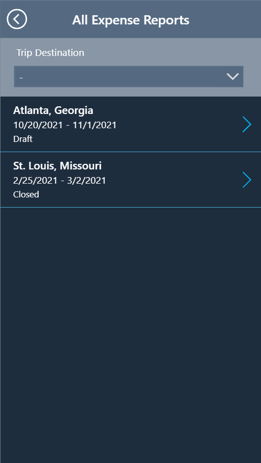

Now that you have chosen to use a canvas app, you will need to explore the various components of the complete solution so that you have a visual as you move forward into building and designing the app.

The **Welcome** screen allows users to choose the direction of their time in the app. They can create new expense reports, review submitted reports, or pick up a previous draft.

> [!div class="mx-imgBorder"]
> 

The **Expense Report** screen shows details of an expense report, such as details that are necessary for creating a new expense report, editing a draft report, or viewing the details of an older report.

> [!div class="mx-imgBorder"]
> 

In the **Multiple Expense Reports** screen, employees can choose from existing expense reports to edit or view individual reports. Employees can only view their own reports in this module's solution, but you can add a supervisor or accounting filter so that employees can view other reports that they might need to approve.

> [!div class="mx-imgBorder"]
> 

With the endless possibilities in Microsoft Power Apps, you can add more screens and functionality. However, for this module, you'll focus on these three screens so that you have a learning foundation. As a challenge, try to add more functionality to this solution after you've completed the scenario.
