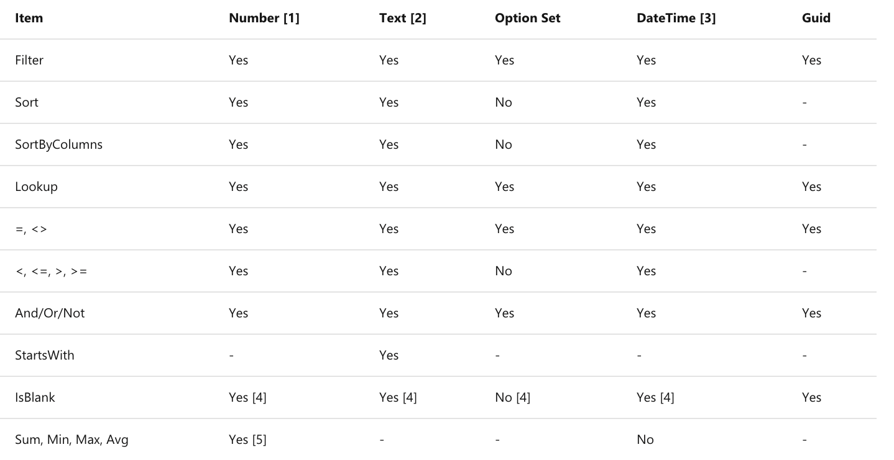

Determining when delegation will and will not happen is a combination of several variables. The first thing to consider is the data source. The following table shows the different functions and whether they support delegation for Microsoft Dataverse. In this table, **Yes** means the data source does the processing across all of the records. **No** means the data source returns only the first 500 (default) records to Power Apps, and Power Apps then processes the function locally.

>

1.	Numbers with arithmetic expressions like `Filter(entity, field + 10 > 100)` aren't delegable. Language and TimeZone aren't delegable.
2.	Doesn't support Trim[Ends] or Len. Supports other functions such as Left, Mid, Right, Upper, Lower, Replace, and Substitute.
3.	DateTime can be delegated except for DateTime functions Now() and Today().
4.	Supports comparisons. For example, Filter(EntityName, MyCol = Blank()).
5.	The aggregate functions are limited to a collection of 50,000 records. If needed, use the Filter function to select 50,000 records from a larger set before using the aggregate function.

[Dataverse](https://docs.microsoft.com/connectors/commondataservice/) has more info about using the Dataverse as a data source, and about its delegable functions.

This table is only for supported delegable functions if you use the Dataverse as a data source. But what if you use a different data source, like SharePoint or SQL?   

## Other data sources: SharePoint and SQL

If you use SharePoint or SQL as a data source, review the supported delegable functions and associated documentation for these data sources. As stated at the beginning of this module, the supported delegable functions vary depending on the data source you use. Every data source is slightly different as to what is delegable and what is non-delegable. It’s highly recommended to review the different data sources before you begin the app building process. That way, you'll have a better understanding of what’s supported and also of any limitations. Every Power Apps solution has specific business requirements. It’s important to ensure that the data source supports those requirements with the functions you need for the amount of data you have.

Additionally, if you use the Filter or LookUp function, then you also use a predicate. The predicate is what allows you to evaluate the formula. The function `FirstName = "Rob"` uses the = predicate. Some data sources don't support certain predicates. For example, Salesforce doesn't support the IsBlank predicate. So although the formula `Filter(SalesforceCustomers, Name = "Contoso")` is delegable, the formula `Filter(SalesforceCustomers, IsBlank(Name))` isn't delegable.

## The Column type can also factor in

The column type can also affect whether delegation is possible. Complex columns, like a SharePoint lookup column, aren't delegable. These columns have deeper logic and are only processable locally by Power Apps. The good news is that if you use a complex column, Power Apps provides visual warning indicators so you can correct the issue. The visual warning indicator is the key to identifying any delegation issues in your Power App. A blue underline anywhere in your formula bar indicates that there's a delegation issue with your formula. It may not return all of your records unless it's corrected. In the next section you'll learn more about delegation warnings, limits, and how to work around them if you ever run into a delegation issue.