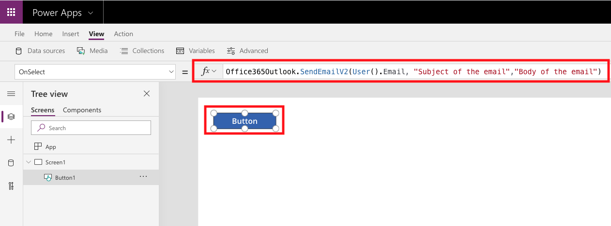

To begin, add a data source to your app. In Power Apps, there are multiple ways to add a data source. For example, when you add a gallery or a form to the screen, you can use that interface to choose an existing data source or add a new one. Sometimes you must add a data source for a control to complete an action. For example, adding a data source to a button to send an email.

## Add a tabular data source such as a SharePoint list

Add tabular data sources by following the same steps as in the previous procedure, or from the properties of a control. In this example, you'll add a SharePoint Online list as a data source to your app from a gallery control.

1.  On the **Insert** tab, select **Gallery**, and then select the option for a vertical gallery.

1.  In the properties pane, select the drop-down menu for the **Data source** property.

	> [!div class="mx-imgBorder"]
	> 

1.  In Search box type **SharePoint** and select **SharePoint** from the list. You could have also expanded **Connectors** and scrolled through all the available connectors until you found the **SharePoint** connector.

1.  Select **+ Add a connection**.

1.  At the bottom of **Connect to data**, select **Connect**.

	In order to connect to an on-premises SharePoint server, you need to have selected the on-premises data gateway.

1.  When prompted, perform either of these steps:

    -   Select a SharePoint site from the **Recent sites** list.

    -   Type or paste the site's URL, select **Go**, and then select the list that you want to use.

1.  Under **Choose a list**, select the list or lists you want to connect to. 

1.  Select **Connect**.

You’ve connected to your SharePoint list, and you can display the data in the gallery control.

## Add an action data source such as Office 365 Outlook

You can use this method to add any data source. After it’s added, it will be available throughout your app.

1.  In Power Apps Studio, select the **View** tab.

1.  In the ribbon, select **Data sources**.

1.  In the **Data** pane, type **Office** in Search and select **Office 365 Outlook** from the list. You could have also expanded **Connectors** and scrolled through all the available connectors until you found the **Office 365 Outlook** connector.

	> [!div class="mx-imgBorder"]
	> 

1.  Select **+ Add a connection** and then select **Connect**.

1.  After your data source is added, close the **Data sources** pane by selecting the close icon (X) to the right of **Data sources**.

Now the Office 365 Outlook data source is available for use in your app.

To send an email, add a button control to your app, and set its **OnSelect** property to the highlighted formula:

> [!div class="mx-imgBorder"]
> 

This formula will do the following.

| Formula argument | Formula input     | Notes     |
| :------------------- | :------------------:  |:----------------|
| To                   | User().Email          | The current user is the person to whom the email will be sent. |
| Subject              | "Subject of the email"|             |
| Body                 | "Body of the email"   |              |

An important concept to understand about data sources is that some data sources, such as SQL Server, use stored credentials that are shared by all users of the connector. Others, such as Microsoft Dataverse, SharePoint, and other Office 365 connectors, use the user's credentials. For example, every user who uses an app based on data in a SharePoint list needs the appropriate permissions in SharePoint to interact with that data.

In the next unit of this module, you'll learn more about the gallery control and how to display your data. 
