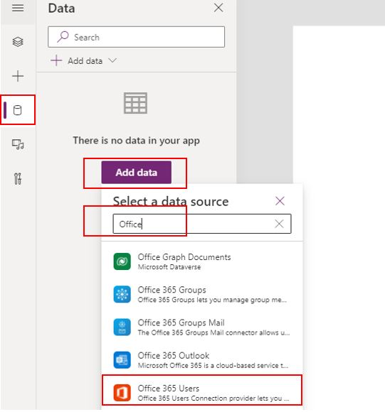
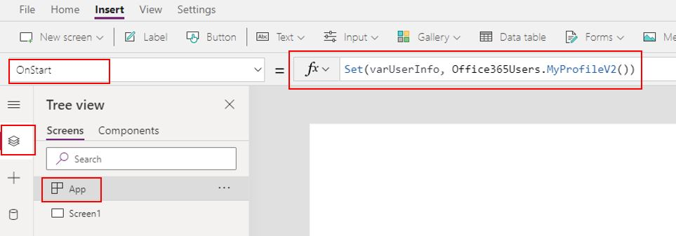
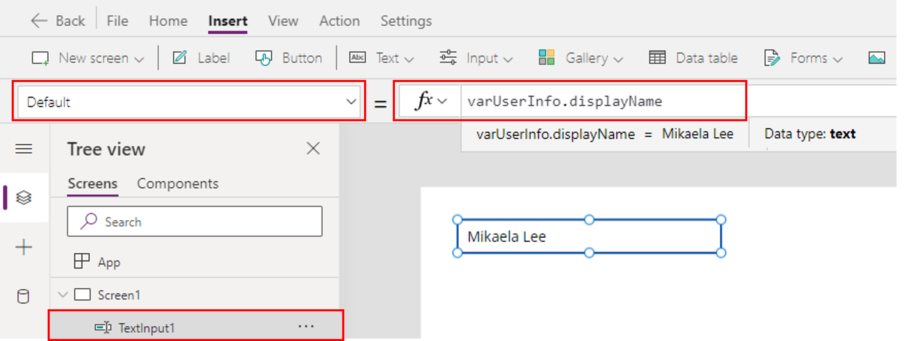
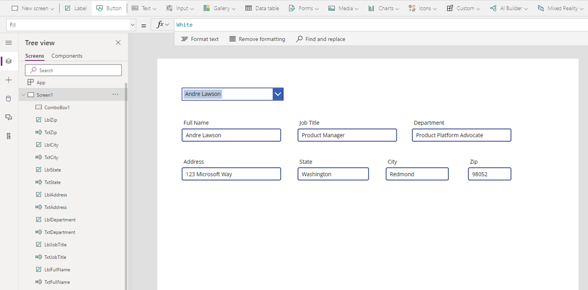
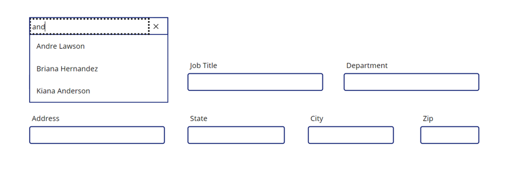
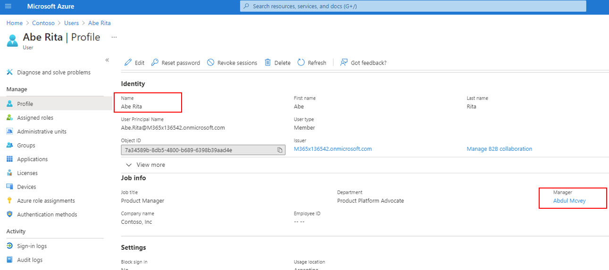
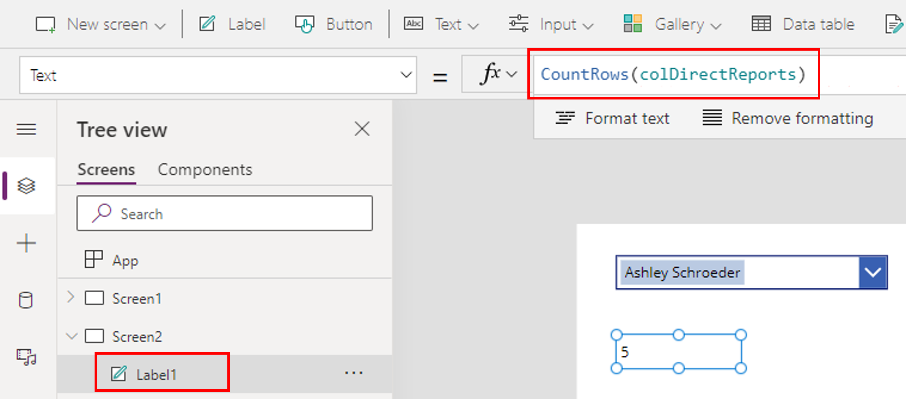
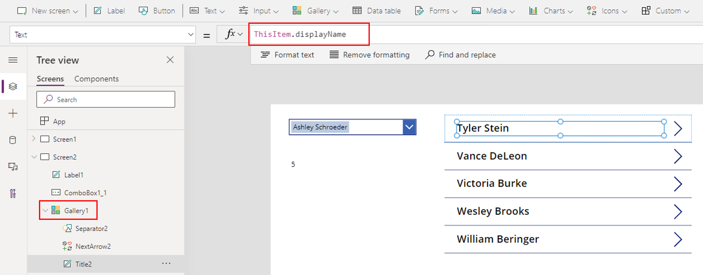

The Office 365 Users connection for Power Apps lets you access user profiles in your organization using your Office 365 account. You can perform various actions such as get your profile, get a user's profile, get a user's manager, or get direct reports.

You can display this information in a label on your app. You can display one function, multiple functions, or even combine different functions. For example, you can use this function to make the app sound more personal by greeting the user with their display name and saving the time of logging into the app by automatically populating certain fields.

## Add a connection

The Office 365 Users is a Standard connector that can be used in Power Apps. To add the connector, select Data, Add data and search for 'Office'. Select Office 365 Users and select Office 365 Users again.

> [!div class="mx-imgBorder"]
> 

> [!div class="mx-imgBorder"]
> 

If this is the first time you're adding this connector in this environment, you'll see the following pop-up message, select Connect to add this connection.

> [!div class="mx-imgBorder"]
> 

## User profile information

You have a few options to get user information in the canvas app. To get information about the user who is using the app, you can either use the function at the **App OnStart** or **OnSelect** of a button.

### App OnStart

Here we'll get the user information we're looking for and save it to a global variable making it easy to reuse it throughout the app.

Select App, select the OnStart property and add the following formula.

`Set(varUserInfo, Office365Users.MyProfileV2())`

> [!div class="mx-imgBorder"]
> 

To populate the variable, right-click on **App** and select **RunOnStart.**

With the global variable name **varUserInfo** now populated, you can call that information anywhere in the app. For example, in the **Default** property of a Text control, you can add `varUserInfo.displayName`.

> [!div class="mx-imgBorder"]
> 

Below shows the attributes that can be automatically populated in your app saving the user time to input them manually.

> [!div class="mx-imgBorder"]
> 

### Control OnSelect

If you need to gather information about another user, add a **ComboBox** control and set the Items property to `Office365Users.SearchUser()` , the SelectMultiple property to `false`, the DisplayFields property to `["DisplayName"]`, and the OnChange property to `Set(varUserInfo, Office365Users.UserProfile(ComboBox1.Selected.Id))`.

> [!div class="mx-imgBorder"]
> 

> [!div class="mx-imgBorder"]
> 

## Manager information

In addition to getting user information, you can also search for a user's manager information.

For a **ComboBox** control, set the Items property to `Office365Users.SearchUser()`,  the SelectMultiple property to `false`, the DisplayFields property `["DisplayName"]`,  and the OnChange property to `Set(varUserInfo, Office365Users.Manager(ComboBox1.Selected.Id))`.

> [!div class="mx-imgBorder"]
> 

You can confirm this is the correct manager by verifying in Azure Active Directory.

> [!div class="mx-imgBorder"]
> 

## View all direct reports

Another feature that comes with Office 365 Users is the ability to find all the users who directly report to a single manager. This information is gathered from Microsoft Azure Active Directory.

We’ll use a combination of a **Collection** and **Gallery** to present the list of users. A **Collection** is a variable that can store a list of information, which can be easily accessible throughout the use of the app. A **Gallery** control can show multiple records from a data source, and each record can contain multiple types of data. In this scenario, our data source is the **Collection**.

Add a **ComboBox** control and set the Items property to `Office365Users.SearchUser()`. Next, set the SelectMultiple property to `false`, the DisplayFields property `["DisplayName"]`, and the OnSelect property to `ClearCollect(colDirectReports, Office365Users.DirectReportsV2(ComboBox1_1.Selected.Id).value)`.

We can now present two pieces of information; one is to see how many users directly report to a manager and also list their names.

To get a count of many users' report, add a **Label** control and set it's **Text** property to `CountRows(colDirectReports)`.

> [!div class="mx-imgBorder"]
> 

To display all the direct reports, add a **Vertical Gallery** option from the Insert menu and set its **Items** property to **colDirectReports**.

> [!div class="mx-imgBorder"]
> 

For more information on the Office 365 User connection, see [Office 365 Users Connector Documentation.](/connectors/office365users/?azure-portal=true)