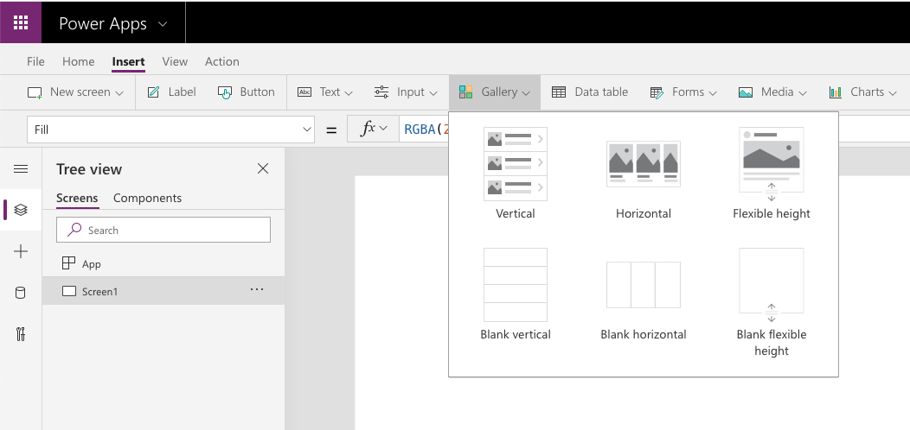
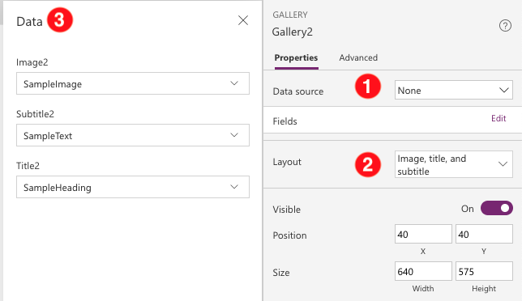

Galleries display the contents of a table in a data source or a
collection. A gallery contains a space for each record in your data
source. You can configure the gallery template to display the
information the way you want, and the Gallery will repeat that layout
for each row in the table.

You add a gallery to your canvas app by opening it in PowerApps Studio,
selecting the **Insert** tab, selecting **Gallery**, and then selecting
the type of gallery to add.

The top row includes **Vertical**, **Horizontal**, and **Flexible
height** options that contain preconfigured controls to help you get
started. The bottom row has the same options, just without preconfigured
controls. The remainder of this example uses a **Vertical** gallery.

When you select a gallery, it's added to your canvas, and the **Data**
pane appears near the right side of the screen.

1.  Select an existing data source or add one. The data source that you
    select is reflected in the **Items** property of the gallery
    control. You can modify that property by typing or pasting a formula
    into the formula bar. **Filter**, **Search**, and **Sort** functions
    can manipulate what data the gallery shows. If your gallery displays
    a list of requests, you might filter the list to show only the
    requests for the user who's signed in. The next unit covers this
    concept in more detail.

2.  Under **Layout**, you can select one of several types of list views
    or gallery views of your data, which sets a default layout of your
    data and the available controls. You can still manually modify the
    gallery template to add controls and build a design to meet your
    business needs.

3.  In the bottom section, select the columns to include in the gallery.
    The previous screenshot showed the option that includes a title,
    subtitle, and image. For each control, you can open a drop-down
    list and select which field you want to show in that control. It's
    important to remember that, as with the data source, you can still
    modify these properties to make your data look the way you want.

After you configure the gallery in the **Data** pane, you can close it
and then edit and design the gallery template the same way you would any
other part of your app.

The sample canvas apps show how much you can customize a gallery. For
example, the Asset Management sample contains this vertical list.

The Leave Request app contains this horizontal gallery with four
columns.

