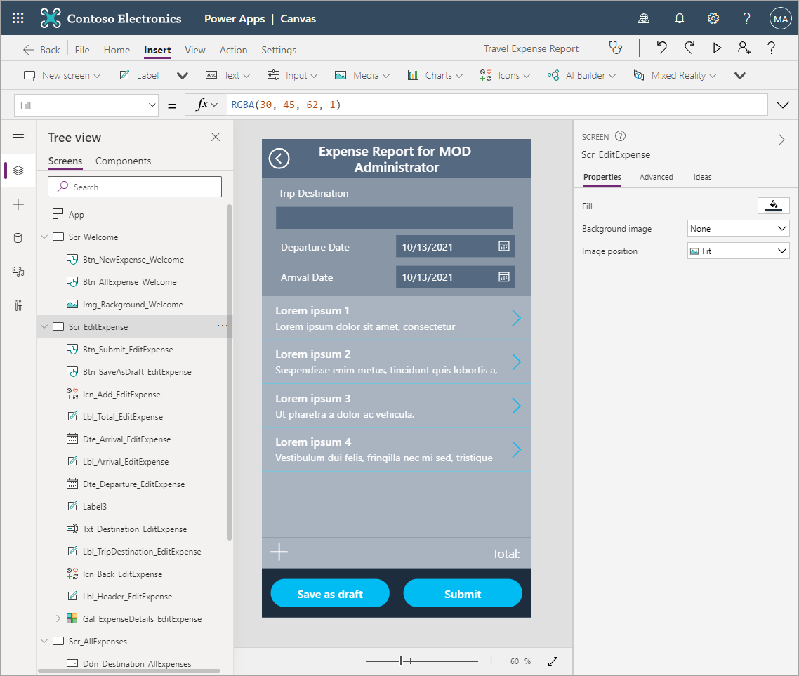
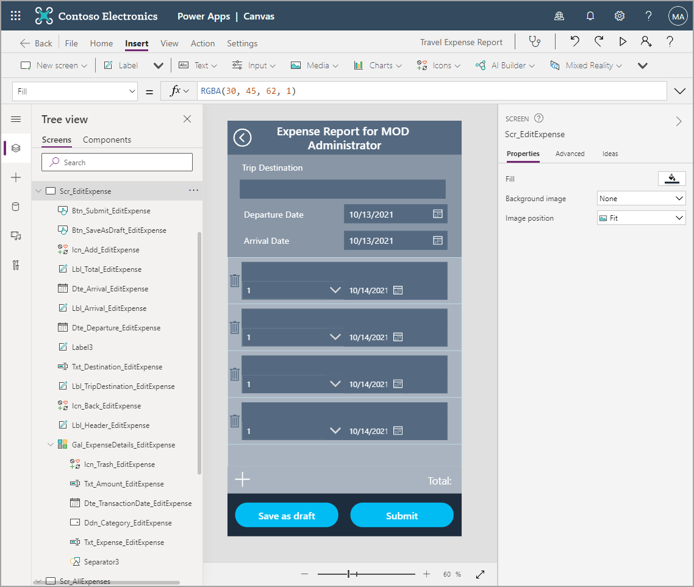

As an app developer, you'll likely also design the app. Though design is outside the scope of this learning path, you might notice a couple of design elements that might help you in future builds.

A simple way to enhance your app's user interface (UI) is by not overcrowding your screens with too many controls. Consider the end user and how they will navigate from screen-to-screen, enter data, view data, and so on. How you design app screens can have as much effect as a poorly functioning app. Users might be less likely to use the app if it's overly complicated and not intuitive.

Therefore, when building your app screens, make sure to use control properties like spacing, alignment, fill, and color. Also, you should use consistent headers and button placement. For example, in this scenario, you're implementing various font colors and font fills, which will help divide the screen pleasantly without it appearing too overwhelming. Notice that the header is one color, the parent information another color, the expense details another, and the main controls yet another color. If you eliminated these colors and left the groups of controls with the same background, it would appear less organized and be more confusing to the user.

## Adjust controls and properties

One benefit of building out later screens in your app is that you can copy controls from previous screens.

1. On the **Tree view**, select **Scr_AllExpenses** and then hold down the **Ctrl** key so that you can select the following controls simultaneously: **Lbl_Header_AllExpenses**, **Icn_Back_AllExpenses**, **Lbl_TripDestination_AllExpenses**.

1. After you've selected the controls, press the **Ctrl + C** keyboard shortcut to copy the controls. Go to **Scr_EditExpense** and press the **Ctrl + V** keys to paste the controls.

1. Rename your newly copied controls with the correct screen name at the end (EditExpense).

1. Update the following properties of your header label to these values:

    - **Text** - "Expense Report for " & VarUser.FullName
    - **PaddingLeft** - 64
    - **PaddingRight** - 64

1. Change the **Height** property of your trip destination label to **281**.

   Your screen should resemble the following screenshot.

      > [!div class="mx-imgBorder"]
      > 

   Many controls are needed for this page. The following list shows the controls that you can add and the properties that you need to change. This process might take a while, but it's important to have all fields for which you need to write data. If you can't find a control, it's typically in the **Input** dropdown menu of the **Insert** tab.

1. Add the following controls and properties:

   - **Text input** control
     - **Default**: ""
     - **Size**: 18
     - **X**: 35
     - **Y**: 162
     - **Width**: 560
     - **Height**: 50
     - **Fill**: Lbl_Header_EditExpense.Fill
     - **Name**: Txt_Destination_EditExpense

   - **Label** control
     - **Text**: "Departure Date"
     - **Size**: 18
     - **X**: 40
     - **Y**: 229
     - **Width**: 280
     - **Height**: 50
     - **Name**: Lbl_Departure_EditExpense

   - **Date picker** control
     - **Size**: 18
     - **X**: 320
     - **Y**: 229
     - **Width**: 280
     - **Height**: 50
     - **Fill**: Lbl_Header_EditExpense.Fill
     - **IconFill**: White
     - **IconBackground**: Lbl_Header_EditExpense.Fill
     - **Name**: Dte_Departure_EditExpense

   - **Label** control
     - **Text**: "Arrival Date"
     - **Size**: 18
     - **X**: 40
     - **Y**: 302
     - **Width**: 280
     - **Height**: 50
     - **Name**: Lbl_Arrival_EditExpense

   - **Date picker** control
     - **Size**: 18
     - **X**: 320
     - **Y**: 302
     - **Width**: 280
     - **Height**: 50
     - **Fill**: Lbl_Header_EditExpense.Fill
     - **IconFill**: White
     - **IconBackground**: Lbl_Header_EditExpense.Fill
     - **Name**: Dte_Arrival_EditExpense

   - **Label** control
     - **Text**: "Total:"
     - **Size**: 21
     - **X**: 0
     - **Y**: 945
     - **Width**: 640
     - **Height**: 74
     - **Align**: Align.Right
     - **Padding Right**: 20
     - **Fill**: ColorFade(Lbl_Header_EditExpense.Fill, 50%)
     - **Name**: Lbl_Total_EditExpense

   - **Icon** control
     - **Icon**: Add
     - **X**: 9
     - **Y**: 955
     - **Width**: 64
     - **Height**: 50
     - **Color**: White
     - **Name**: Icn_Add_EditExpense

   - **Button** control
     - **Text**: "Save as draft"
     - **X**: 22
     - **Y**: 1045
     - **Width**: 280
     - **Height**: 65
     - **Color**: White
     - **Size**: 20
     - **RadiusTopLeft**: 50
     - **RadiusTopRight**: 50
     - **RadiusBottomLeft**: 50
     - **RadiusBottomRight**: 50
     - **Name**: Btn_SaveAsDraft_EditExpense

   - **Button** control
     - **Text**: "Submit"
     - **X**: 337
     - **Y**: 1045
     - **Width**: 280
     - **Height**: 65
     - **Color**: White
     - **Size**: 20
     - **RadiusTopLeft**: 50
     - **RadiusTopRight**: 50
     - **RadiusBottomLeft**: 50
     - **RadiusBottomRight**: 50
     - **Name**: Btn_Submit_EditExpense

   - **Vertical gallery** control
     - **Layout**: Title and subtitle
     - **X**: 0
     - **Y**: 373
     - **Width**: 640
     - **Height**: 572
     - **BorderColor**: RGBA(204, 242, 252, 1)
     - **BorderThickness**: 1
     - **TemplateSize**: 128
     - **Fill**: ColorFade(Lbl_Header_EditExpense.Fill, 50%)
     - **Name**: Gal_ExpenseDetails_EditExpense

   After you have added those controls, your app screen should look similar to the following screenshot.

   > [!div class="mx-imgBorder"]
   > 

   You can certainly return to change some properties, such as calculating a total and writing the **OnSelect** formula for the buttons and icon. However, building out the controls and design first is common in app building. That approach will allow you to concentrate on one task at a time. First, you should focus on the design and ensuring that you have the controls that you need. Then, you can focus on the technical aspects and the logic.

   You still need to add more controls, but they are inside the gallery. To add a control inside a gallery, ensure that you're selecting the first item and then insert as normal. If you don't find the control repeated for every line in the gallery, delete the control and try again. Typically, this situation occurs because the entire gallery is selected instead of only the first item. If the whole gallery is selected, and you attempt to add a control in the gallery, it will add the control outside the gallery. That approach will not work for what you're doing in this scenario.

   The following screenshot shows that only the first item is selected, and it exemplifies what the screen should look like when you're adding controls in your gallery.

   > [!div class="mx-imgBorder"]
   > 

   Before adding new controls, you need to delete the labels and arrow icon because you don't need them.

1. Select the two Labels and the right arrow icon in your gallery and then press the **Delete** key. The only control in your gallery should be the separator. Select it in your **Tree view** and then change the **Fill** property to **RGBA(204, 242, 252, 1)**.

   Your app should now resemble the following image.

   > [!div class="mx-imgBorder"]
   > 

   You still don't have a data source attached to the gallery. You'll complete that task later. For now, remember to select the first item in the gallery and then add the following controls:

   - **Text input** control
     - **Default**: ""
     - **Size**: 16
     - **X**: 40
     - **Y**: 14
     - **Width**: 560
     - **Height**: 50
     - **Fill**: Lbl_Header_EditExpense.Fill
     - **Name**: Txt_Expense_EditExpense

   - **Drop down** control
     - **Size**: 16
     - **X**: 40
     - **Y**: 65
     - **Width**: 280
     - **Height**: 50
     - **Fill**: Lbl_Header_EditExpense.Fill
     - **ChevronBackground**: Lbl_Header_EditExpense.Fill
     - **AllowEmptySelection**: true
     - **Name**: Ddn_Category_EditExpense

   - **Date picker** control
     - **Size**: 16
     - **X**: 320
     - **Y**: 65
     - **Width**: 171
     - **Height**: 50
     - **Fill**: Lbl_Header_EditExpense.Fill
     - **IconFill**: White
     - **IconBackground**: Lbl_Header_EditExpense.Fill
     - **Name**: Dte_TransactionDate_EditExpense

   - **Text input** control
     - **Default**: ""
     - **Size**: 16
     - **X**: 492
     - **Y**: 65
     - **Width**: 108
     - **Height**: 50
     - **Format**: TextFormat.Number
     - **Fill**: Lbl_Header_EditExpense.Fill
     - **Name**: Txt_Amount_EditExpense

   - **Icon** control
     - **Icon**: Trash
     - **X**: 0
     - **Y**: 0
     - **Width**: 40
     - **Height**: 128
     - **Color**: Lbl_Header_EditExpense.Fill
     - **Name**: Icn_Trash_EditExpense

   After you have added these controls in the gallery, your app should resemble the following screenshot.

   > [!div class="mx-imgBorder"]
   > 

Now that you have all controls that are required to make this screen, you can add the functionality.
