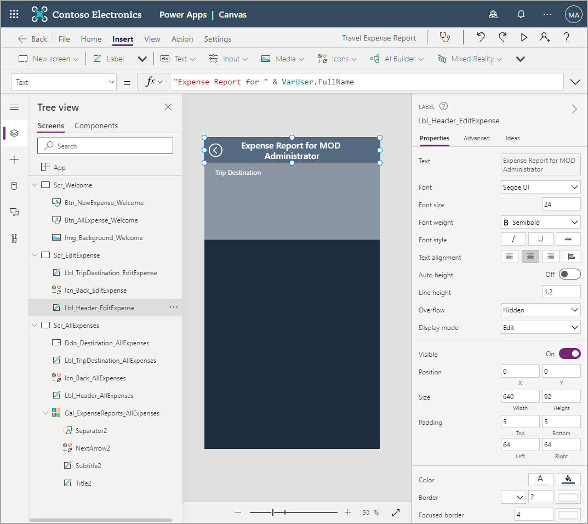
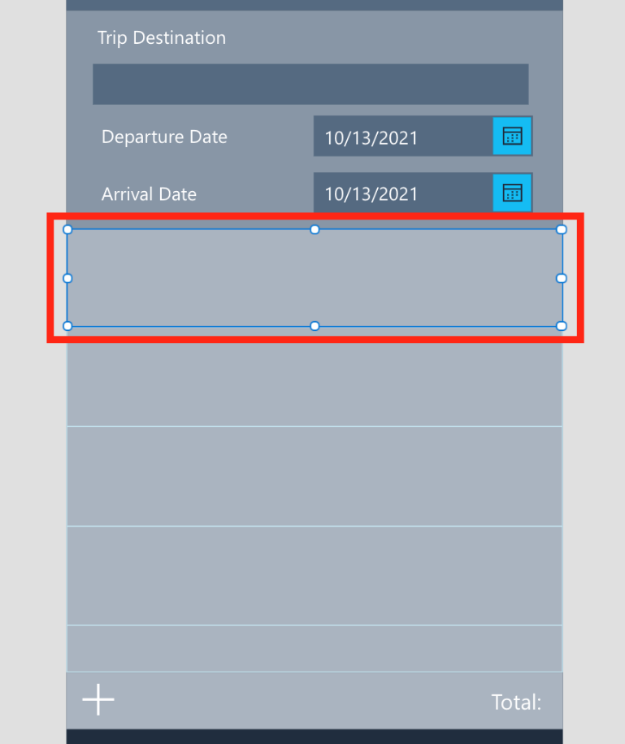
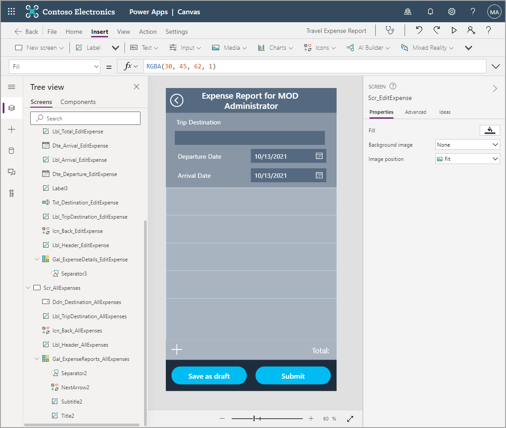

One of the benefits of building out later screens in your app is that you can copy controls from previous screens.

1. On the **Tree view**, select **Scr_AllExpenses** and hold down the **Ctrl** key so you can select the following controls simultaneously: **Lbl_Header_AllExpenses**, **Icn_Back_AllExpenses**, **Lbl_TripDestination_AllExpenses**.

1. Once you've selected all of the controls, press **Ctrl + C** to copy the controls and then visit **Scr_EditExpense** and press **Ctrl + V** to paste the controls.

1. Rename your newly copied controls with the correct screen name at the end (EditExpense).

1. Update the following properties of your header label as well, to these values:

    - **Text**: "Expense Report for " & VarUser.FullName
    - **PaddingLeft**: 64
    - **PaddingRight**: 64

1. Finally, change the **Height** property of your trip destination label to **281**.

   Your screen should look like this:

   > [!div class="mx-imgBorder"]
   > 

   There are many controls needed for this page. Below is a list of controls to add and the properties that need to be changed. This may take a while, but it's important to have all the fields for which we need to write data. If you can't find a control, it's typically in the Input drop down of the Insert tab.

1. Add the following controls and properties, as seen in the tables below:

   - **Text input** control
     - **Default**: ""
     - **Size**: 18
     - **X**: 35
     - **Y**: 162
     - **Width**: 560
     - **Height**: 50
     - **Fill**: Lbl_Header_EditExpense.Fill
     - **Name**: Txt_Destination_EditExpense

   - **Label** control
     - **Text**: "Departure Date"
     - **Size**: 18
     - **X**: 40
     - **Y**: 229
     - **Width**: 280
     - **Height**: 50
     - **Name**: Lbl_Departure_EditExpense

   - **Date picker** control
     - **Size**: 18
     - **X**: 320
     - **Y**: 229
     - **Width**: 280
     - **Height**: 50
     - **Fill**: Lbl_Header_EditExpense.Fill
     - **IconFill**: White
     - **IconBackground**: Lbl_Header_EditExpense.Fill
     - **Name**: Dte_Departure_EditExpense

   - **Label** control
     - **Text**: "Arrival Date"
     - **Size**: 18
     - **X**: 40
     - **Y**: 302
     - **Width**: 280
     - **Height**: 50
     - **Name**: Lbl_Arrival_EditExpense

   - **Date picker** control
     - **Size**: 18
     - **X**: 320
     - **Y**: 302
     - **Width**: 280
     - **Height**: 50
     - **Fill**: Lbl_Header_EditExpense.Fill
     - **IconFill**: White
     - **IconBackground**: Lbl_Header_EditExpense.Fill
     - **Name**: Dte_Arrival_EditExpense

   - **Label** control
     - **Text**: "Total: "
     - **Size**: 21
     - **X**: 0
     - **Y**: 945
     - **Width**: 640
     - **Height**: 74
     - **Align**: Align.Right
     - **Padding Right**: 20
     - **Fill**: ColorFade(Lbl_Header_EditExpense.Fill, 50%)
     - **Name**: Lbl_Total_EditExpense

   - **Icon** control
     - **Icon**: Add
     - **X**: 9
     - **Y**: 955
     - **Width**: 64
     - **Height**: 50
     - **Color**: White
     - **Name**: Icn_Add_EditExpense

   - **Button** control
     - **Text**: "Save as draft"
     - **X**: 22
     - **Y**: 1045
     - **Width**: 280
     - **Height**: 65
     - **Color**: White
     - **Size**: 20
     - **RadiusTopLeft**: 50
     - **RadiusTopRight**: 50
     - **RadiusBottomLeft**: 50
     - **RadiusBottomRight**: 50
     - **Name**: Btn_SaveAsDraft_EditExpense

   - **Button** control
     - **Text**: "Submit"
     - **X**: 337
     - **Y**: 1045
     - **Width**: 280
     - **Height**: 65
     - **Color**: White
     - **Size**: 20
     - **RadiusTopLeft**: 50
     - **RadiusTopRight**: 50
     - **RadiusBottomLeft**: 50
     - **RadiusBottomRight**: 50
     - **Name**: Btn_Submit_EditExpense

   - **Vertical gallery** control
     - **Layout**: Title and subtitle
     - **X**: 0
     - **Y**: 373
     - **Width**: 640
     - **Height**: 572
     - **BorderColor**: RGBA(204, 242, 252, 1)
     - **BorderThickness**: 1
     - **TemplateSize**: 128
     - **Fill**: ColorFade(Lbl_Header_EditExpense.Fill, 50%)
     - **Name**: Gal_ExpenseDetails_EditExpense

   After adding all of those controls, your app screen should look something like this:

   > [!div class="mx-imgBorder"]
   > 

   There are certainly some properties we'll go back and change, such as calculating a total and writing the OnSelect formula for the buttons and icon. But building out the controls and design first is common in app building. That allows you to concentrate on one thing at a time. First the design and ensuring you have all the controls you need, and then the technical aspects and the logic.

   There are still more controls we need to add, but all of them are inside of the gallery. To add a control inside a gallery, ensure you're selecting the first item and then insert as normal. If you don't see the control repeated for every line in the gallery, delete the control and try again. When this happens, it's typically because the entire gallery is selected instead of just the first item of the gallery. If the whole gallery is selected and you attempt to add a control in the gallery, it will add the control outside the gallery. That won't work for what we're doing in this scenario.

   In the screenshot below, you can see only the first item is selected. This is what it should look like when adding controls in your gallery.

   > [!div class="mx-imgBorder"]
   > 

   Before adding new controls, we're going to delete the labels and arrow icon since we don't need them.

1. Select the two Labels and the right arrow Icon in your gallery and press **Delete**. The only control in your gallery should be the separator. Select it in your Tree view and change the **Fill** property to **RGBA(204, 242, 252, 1)**.

   Your app should look like this:

   > [!div class="mx-imgBorder"]
   > 

   We still don't have a data source attached to the gallery--we'll take care of that later. For now, remember to select the first item in the gallery and add the following controls:

   - **Text input** control
     - **Default**: ""
     - **Size**: 16
     - **X**: 40
     - **Y**: 14
     - **Width**: 560
     - **Height**: 50
     - **Fill**: Lbl_Header_EditExpense.Fill
     - **Name**: Txt_Expense_EditExpense

   - **Drop down** control
     - **Size**: 16
     - **X**: 40
     - **Y**: 65
     - **Width**: 280
     - **Height**: 50
     - **Fill**: Lbl_Header_EditExpense.Fill
     - **ChevronBackground**: Lbl_Header_EditExpense.Fill
     - **AllowEmptySelection**: true
     - **Name**: Ddn_Category_EditExpense

   - **Date picker** control
     - **Size**: 16
     - **X**: 320
     - **Y**: 65
     - **Width**: 171
     - **Height**: 50
     - **Fill**: Lbl_Header_EditExpense.Fill
     - **IconFill**: White
     - **IconBackground**: Lbl_Header_EditExpense.Fill
     - **Name**: Dte_TransactionDate_EditExpense

   - **Text input** control
     - **Default**: ""
     - **Size**: 16
     - **X**: 492
     - **Y**: 65
     - **Width**: 108
     - **Height**: 50
     - **Format**: TextFormat.Number
     - **Fill**: Lbl_Header_EditExpense.Fill
     - **Name**: Txt_Amount_EditExpense

   - **Icon** control
     - **Icon**: Trash
     - **X**: 0
     - **Y**: 0
     - **Width**: 40
     - **Height**: 128
     - **Color**: Lbl_Header_EditExpense.Fill
     - **Name**: Icn_Trash_EditExpense

   After adding all of the controls in the gallery, your app should look like this:

   > [!div class="mx-imgBorder"]
   > 

Now that we have all of the controls required to make this screen, we can concentrate on adding the functionality.

## A quick note on design

As an app developer, you'll probably also design the app. Although getting into design is outside the scope of this learning path, you'll notice a couple of design elements that may help you in future builds.

One of the easiest ways to enhance your app's User Interface is by not overcrowding your screens with too many controls. Think about the end user, how they're going to navigate from screen-to-screen, enter data, view data, and so on. How you design and lay out app screens can have as much effect as a poorly functioning app. Users may be less likely to use the app if there's too much going on and it's not intuitive.

So when building your app screens, make sure to use control properties like spacing, alignment, fill, and color. Use consistent headers and button placement. For example, in this scenario we're implementing various font colors and font fills, which help break up the screen nicely without making it look too overwhelming. Notice that the header is one color, the parent information another, the expense details another, and the main controls yet another color. If we eliminated these colors and left the groups of controls with the same background, it would be much less organized and more confusing to the user.
