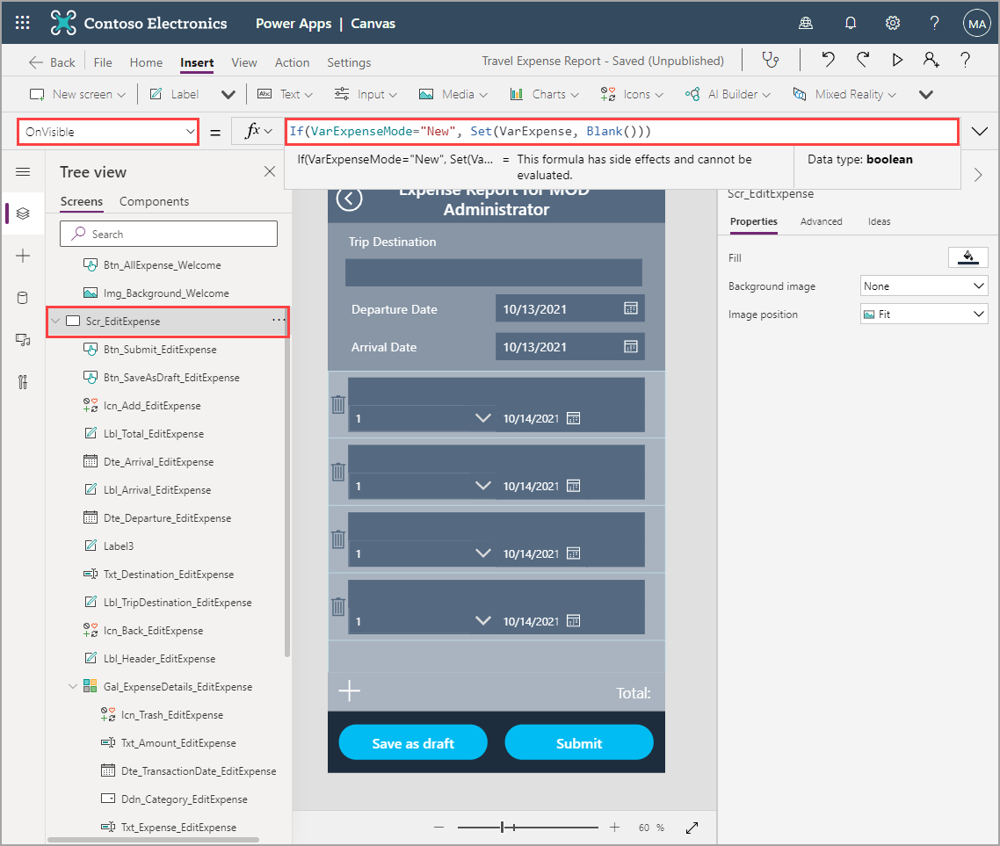
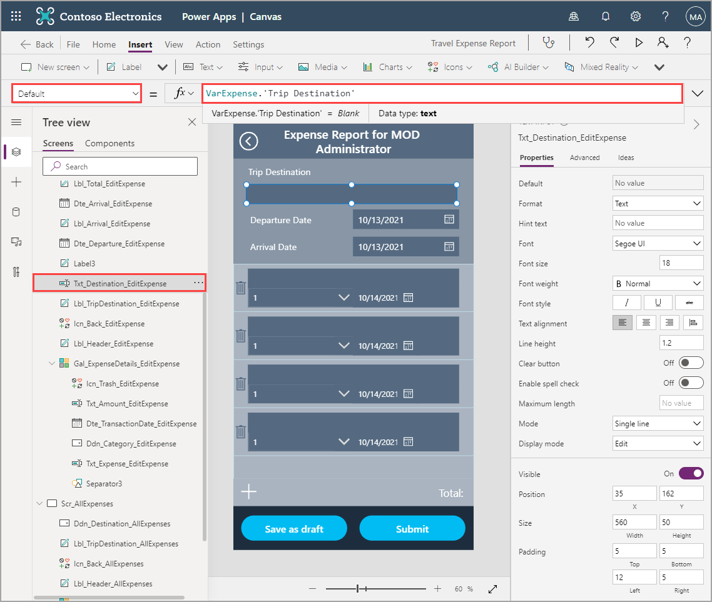

Now that your data is set up, you need to write to two tables on this screen. You'll learn about the concepts of writing to a data source by writing the parent table first: the **Expense Report** table. Additionally, this screen doesn't only need to write new records, it needs to edit existing drafts and show information for expense reports that have already been submitted. As a result, you need to tell the fields which record is being edited or displayed. Also, you need to tell it whether to create a new record. To complete these tasks, you'll need a couple of variables.

## Use variables to control data flow

To use variables to control data flow, follow these steps:

1. From the **Tree view**, select **Scr_Welcome**.

1. Select the **Btn_NewExpense_Welcome** button and add to the existing **OnSelect** property code. To make sure that functions run concurrently, you need to separate them by a semicolon, so after the **Navigate()** function, add **`;Set(VarExpenseMode, "New")`**. Remember, you can format the text to be cleaner.

   The **OnSelect** property should now appear similar to the following image.

   > [!div class="mx-imgBorder"]
   > [](../media/on-select.png#lightbox)

   Other than navigating screens as before, you're also creating a variable to tell you that a new record needs to be created.

   You'll complete the same process for **Scr_AllExpenses**.

1. From the **Scr_AllExpenses** screen, select the **next** arrow in **Gal_ExpenseReports_AllExpenses**.

1. Update the **OnSelect** property with the following code: **Set(VarExpenseMode, "Edit"); Set(VarExpense, ThisItem); Navigate(Scr_EditExpense)**

   The **OnSelect** property will now resemble the following screenshot.

   > [!div class="mx-imgBorder"]
   > [](../media/next.png#lightbox)

   This time, you're setting a variable to tell you to edit an existing record. You're also setting a variable to tell you which record needs to be edited. Then, you'll navigate to the next screen.

   Return to the **Scr_EditExpense** screen to observe these variables in action.

1. Set the **OnVisible** property of **Scr_EditExpense** to **`If(VarExpenseMode="New", Set(VarExpense, Blank()))`**. This setting will ensure that the fields don't hold data from a previous record. You could also use the button on your welcome screen, but the point of learning is to discover different methods. You might notice that the **If** statement only has a true value. If only a true value is defined and the condition is false, nothing will happen.

   > [!div class="mx-imgBorder"]
   > [](../media/on-visible.png#lightbox)

   With the variables in place, you can reference existing data and then clear it out.

1. For **Txt_Destination_EditExpense**, set the **Default** property to **`VarExpense.'Trip Destination'`**, as shown in the following image.

   > [!div class="mx-imgBorder"]
   > [](../media/default.png#lightbox)

   Take a moment to test this variable.

1. From the **Scr_AllExpenses** screen, select the **next** arrow for a record by holding down the **Alt** key or by putting the app in **Play** mode. A destination should display if you're navigating from the **Scr_AllExpenses** screen, and a blank field will display if you're navigating from the **Scr_Welcome** screen.

1. Return to the **Scr_EditExpense** screen and modify the **DefaultDate** property for **Dte_Departure_EditExpense** to **VarExpense.'Departure Date'**.

1. Modify the **DefaultDate** property for **Dte_Arrival_EditExpense** to **VarExpense.'Arrival Date'**.

Remember, if you're having difficulty finding a property for a control, you can always find all properties on the toolbar, in the **Properties** dropdown menu, or in the **Properties** pane.

After you have set those properties, the dates should behave exactly as the destination field. Put the app in **Play** mode to test the functionality so far.

   > [!div class="mx-imgBorder"]
   > [](../media/play.png#lightbox)

Now that your app is functioning well, it's time to start setting up the app logic for writing data from the app back to your tables.

## Configure app logic

In this scenario, and in many real-world scenarios, users will need the functionality to add new items and edit existing items. Additionally, you will want to include the functionality for users to save as draft. This functionality allows them work on an item over multiple days or sessions before they submit for approval. 

1. On the **Scr_EditExpense** screen, select **Btn_SaveAsDraft_EditExpense** and then change the **OnSelect** property as follows:

   ```powerappsfl
   Set(
   VarExpense,
   Patch(
      'Expense Reports',
      If(
         VarExpenseMode = "New",
         Defaults('Expense Reports'),
         VarExpense
      ),
      {
         'Trip Destination': Txt_Destination_EditExpense.Text,
         'Departure Date': Dte_Departure_EditExpense.SelectedDate,
         'Arrival Date': Dte_Arrival_EditExpense.SelectedDate,
         'Report Status': ['Report Status'.Draft],
         Traveler: LookUp(
               Users,
               'Primary Email' = VarUser.Email
         )
      }
   )
   )
   ```

This code is the most complex piece that you've done so far in this learning path. To help you better understand what this code is doing, the following section provides an explanation of what's happening.

The first task that you're doing is using the **Set()** function. This function sets **VarExpense** to include any changes that you make, including the new unique identifier if a new item is being created.

The **Patch()** function allows you to write to a data source by defining:

- **The source** - 'Expense Reports'
- **The record to be altered** - `If(VarExpenseMode="New",Defaults('Expense Reports'),VarExpense)`
- **What needs to be written** - `{'Trip Destination':Txt_Destination_EditExpense.Text,'Departure Date':Dte_Departure_EditExpense.SelectedDate,'Arrival Date':Dte_Arrival_EditExpense.SelectedDate,'Report Status':['Report Status'.Draft],Traveler:LookUp(Users,'Primary Email'=VarUser.Email)}`

The record to be written is wrapped in an **If()** statement that looks at the **VarExpenseMode** variable. If the item is **New**, you would use **`Defaults('Expense Reports')`**. However, if the record already exists in your table, you can use **VarExpense** to update the existing item because it holds all information that Microsoft Dataverse needs to understand which record is being edited or updated.

The item information can be difficult, but it's a significant reason for changing your control names to something that makes logical sense. The text and date fields, such as **Trip Destination** and **Departure Date**, are reasonably simple to write. You would reference the control in which the information is entered, and then explore further in that control to find the exact information, such as **'Text'** for a text input or **'SelectedDate'** for a date picker. The last two fields are more complicated.

**Report Status** is a choice field and **Traveler** is a lookup to the User table. Choice fields in Dataverse require a table of data, which simply means that you need to add brackets **[]** around the table. Inside the brackets, you would write the field name again to fetch the possible choices, investigate deeper with the period, and Power Apps will provide you with the list of available choices.

   > [!div class="mx-imgBorder"]
   > [](../media/report-status.png#lightbox)

For the **Traveler** field, you're finding the signed-in user in the Users table by using a **LookUp()** function. The **LookUp()** function uses the data source *Users* to find the first record in that table that fits the **`'Primary Email' = VarUser.Email`** condition. For this reason, it's important to use a field that will be unique, such as email.

As you continue through this module, take your time. If needed, try breaking down the code into smaller pieces. This approach will help with learning, ultimately helping you become a better Power Apps developer.

   > [!div class="mx-imgBorder"]
   > [](../media/save-draft.png#lightbox)

Congratulations, the **Save as Draft** functionality is complete.
