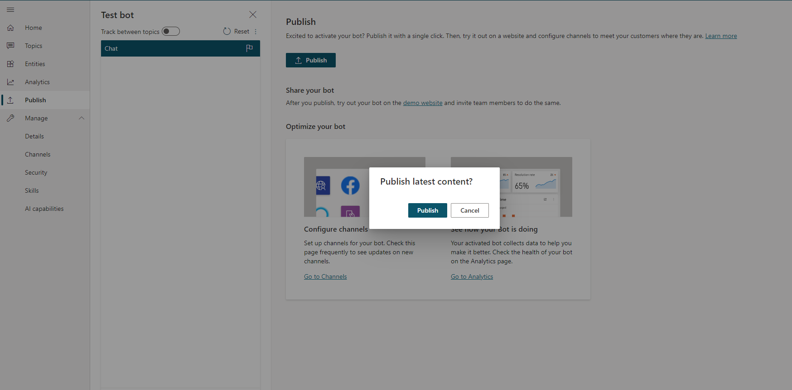
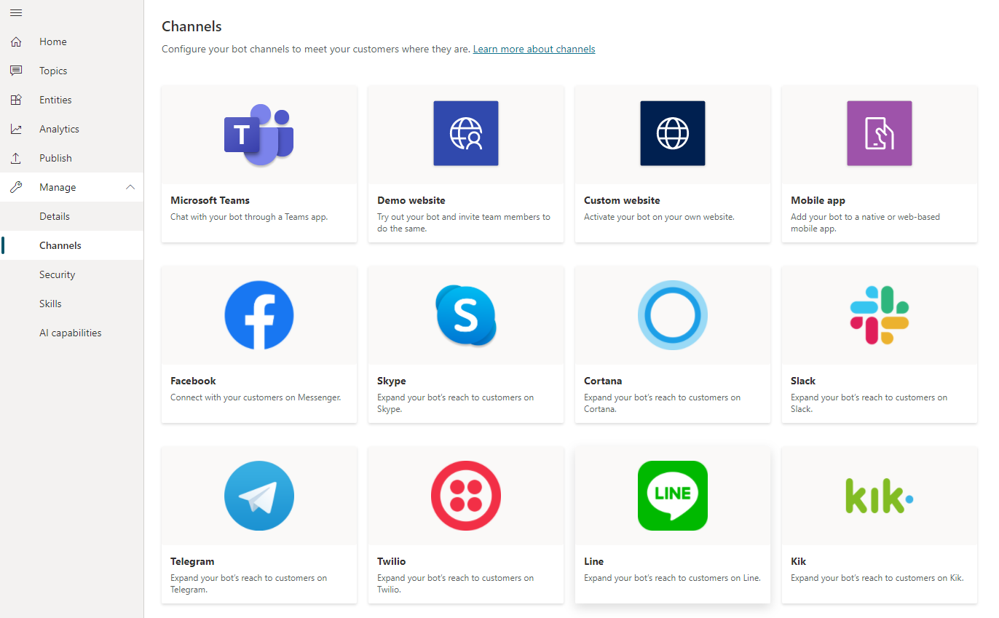

With Power Virtual Agents, you can publish chatbots to engage with your
customers on multiple platforms or channels. These include live websites, mobile
apps, and messaging platforms like Microsoft Teams and Facebook.

After you have published at least once, you can connect your chatbot to
additional channels.

Each time you want to update your chatbot, you publish it again from within the
Power Virtual Agents app itself. This will update the chatbot across all the
channels where you have inserted or connected your chatbot.

## Publish the latest chatbot content

You need to publish the chatbot at least once before your customers can interact
with it or you can share it with your teammates.

After the first publish, you can do subsequent publishes whenever you would like
your customers to engage with the latest chatbot content.

1.  Go to the **Publish** tab on the side navigation pane.

2.  Select **Publish** to make the latest chatbot content available to your customers. The publishing process will check for errors in the latest chatbot content.

Publication should take less than a few minutes and, when successful, you can
view the bot in action and share it with your team by selecting the **demo
website** link. This is useful to gather feedback from stakeholders involved in
the bot. The link will open a new tab and display a prebuilt demo website where
you and your team can interact with the bot.

>[!TIP]
>**What's the difference between the test chat and the demo website?** The demo website lets you share a URL with other members of your team, or other stakeholders who want to try out the bot. It's not intended for production uses (for example, you shouldn't use it directly with customers). The test chat is intended for bot authors to test how conversation nodes flow and if there are errors when they are creating and testing their bot.

## Configure channels

After publishing your bot at least once, you can add channels to make the bot
reachable by your customers. You can see what channels we currently support by
selecting **Manage** and going to the **Channels** tab in the side navigation
pane.

Each channel requires different steps and configurations.

## Channel experience reference table

Different channels have different end-user experiences. The following table
shows a high-level overview of the experiences for each channel. You can take
the channel experiences into account when optimizing your bot content for
specific channels.

|**CHANNEL EXPERIENCE REFERENCE TABLE**||||
|--|--|--|--|
|**Experience**|**Website**|**Microsoft Teams**|**Facebook**|
| [Customer satisfaction survey](https://docs.microsoft.com/power-virtual-agents/authoring-create-edit-topics#insert-nodes) | Adaptive card | Text-only | Text-only |
| [Multiple-choice options](https://docs.microsoft.com/power-virtual-agents/authoring-create-edit-topics#insert-nodes)      | Supported     | [Supported up to 6](https://docs.microsoft.com/microsoftteams/platform/concepts/cards/cards-reference#hero-card) | [Supported up to 13](https://developers.facebook.com/docs/messenger-platform/send-messages/quick-replies/) |
| [Markdown](https://daringfireball.net/projects/markdown/)                                                                       | Supported     | Supported                                                                                                              | [Partially supported](https://www.facebook.com/help/147348452522644?helpref=related)                       |
| [Welcome message](https://docs.microsoft.com/power-virtual-agents/authoring-create-edit-topics#insert-nodes)              | Supported     | Supported                                                                                                              | Not supported                                                                                              |
