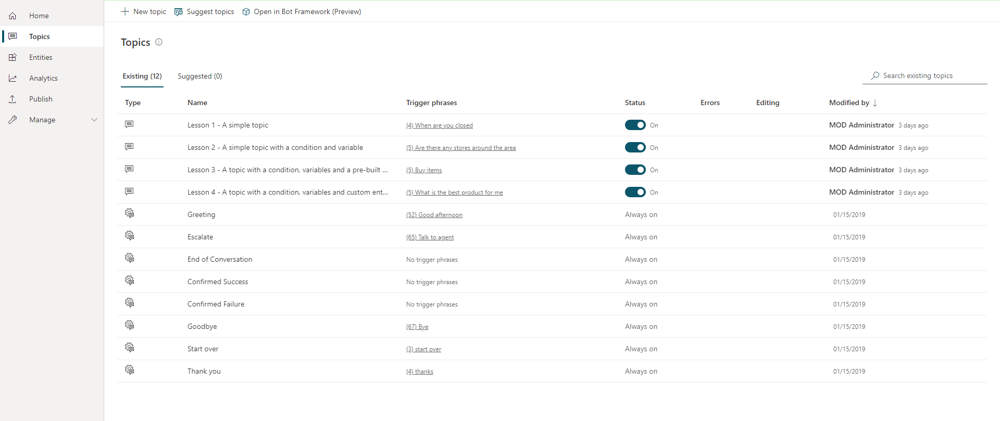

When you create chatbots with Power Virtual Agents, you author and edit topics.
Topics are discrete conversation paths that, when used together within a single
chatbot, allow for users to have a conversation with a chatbot that feels
natural and flows appropriately. Creating a chatbot with Power Virtual Agents is
easy to do with the no-code authoring canvas, and there are a number of ways you
can manage how topics interact, how you want the conversation to flow, and what
it should feel like. It is also easy to test the chatbot without having to fully
deploy the chatbot whenever you make a small change. There are also lesson
topics that guide you through topic authoring - from simple to complex
scenarios, as well as default system topics. You can also choose what language
you want your chatbot to use.

## Topics

In Power Virtual Agents, a topic defines how a chatbot conversation plays out.
You can author topics by customizing provided templates, create new topics from
scratch, or get suggestions from existing help sites.

A topic has trigger phrases—these are phrases, keywords, or questions that a
user is likely to type that is related to a specific issue—and conversation
nodes—these are what you use to define how a chatbot should respond and what it
should do.

The AI uses natural language understanding to parse what a customer actually
types and find the most appropriate trigger phrase or node.

For example, a user might type "Open hours" into your chatbot—the AI will be
able to match that to the **Store hours** topic and begin a conversation that
asks which store the customer is interested in, and then display the hours the
store is open.

You can see how the chatbot conversation works in practice by testing it in
the **Test chatbot** pane. This lets you fine-tune the topic until you are ready
to deploy it without having to exit the Power Virtual Agents portal.

## Use system and sample topics

When you create a chatbot, a number of topics will be automatically created for
you.

These are:

-   Four prepopulated **User Topics** that are titled as lessons. These lesson
    topics can be used to help understand simple to complex ways of using nodes
    to create chatbot conversations.

-   A number of **System Topics**. These are prepopulated topics that you are
    likely to need during a chatbot conversation. We recommend you keep these
    and use them until you are comfortable with creating an end-to-end chatbot
    conversation.

You can edit both of these topic types in the same manner as for topics you
create; however, you cannot delete them.

## Entities

A big part of chatbot conversations in Power Virtual Agents is natural language
understanding, which is the ability for the AI to understand a user's intent.
For example, natural language understanding is involved when a user might say "I
tried to use my gift card but it doesn't work" and the chatbot is able to route
the user to the topic related to gift cards not working—even if that exact
phrase isn't listed as a trigger phrase.

One fundamental aspect of natural language understanding is to
identify *entities* in a user dialog. An entity can be viewed as an information
unit that represents a certain type of a real-world subject, like a phone
number, zip code, city, or even a person's name.

## Prebuilt entities

Out of the box, Power Virtual Agents comes with a set of prebuilt entities,
which represent the most commonly used information in real-world dialogs, such
as age, colors, numbers, and names.

With the knowledge granted by entities, a chatbot can smartly recognize the
relevant information from a user input and save it for later use.

## Custom entities

The prebuilt entities cover commonly used information types, but on some
occasions, such as when building a chatbot that serves a specific purpose, you
will need to teach the chatbot's language understanding model some
domain-specific knowledge.

## Actions

You can enable your chatbot to perform an action by calling a Microsoft Power
Automate flow. Flows can help you automate activities or call backend systems.
For example, you can use flows with end-user authentication to retrieve
information about a user after they sign in.

You can call flows from within topics, as a discrete **Call an action** node.
You can utilize flows that have already been created in your Power Apps
environment, or you can create a flow from within the Power Virtual
Agents authoring canvas.

>[!IMPORTANT]
>A flow can only be called from a topic located in the same **Common Data Service environment** as your chatbot. Flows must also be in a solution in Power Automate. You can **move flows into solutions,** so they are listed in the authoring canvas.

Flows typically use variables to input and output information. The variables can
then be used in other nodes within the topic.

## Publishing

With Power Virtual Agents, you can publish chatbots to engage with your
customers on multiple platforms or channels. These include live websites, mobile
apps, and messaging platforms like Microsoft Teams and Facebook.

After you have published at least once, you can connect your chatbot to
additional channels.

Each time you want to update your chatbot, you publish it again from within the
Power Virtual Agents app itself. This will update the chatbot across all the
channels where you've inserted or connected your chatbot.

You can also configure a Power Virtual Agents chatbot to provide authentication
capabilities, so users can sign in with any OAuth2 identity provider, such as
Azure Active Directory (Azure AD), a Microsoft account, or Facebook.
