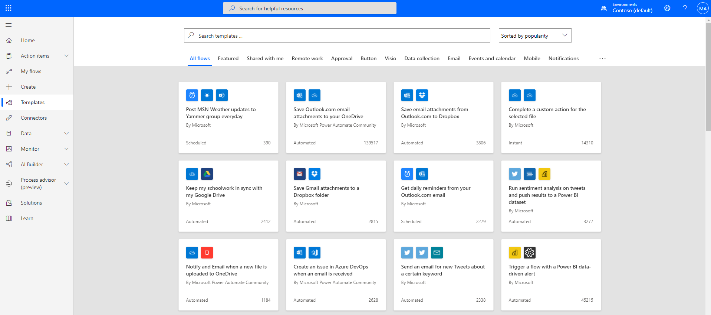
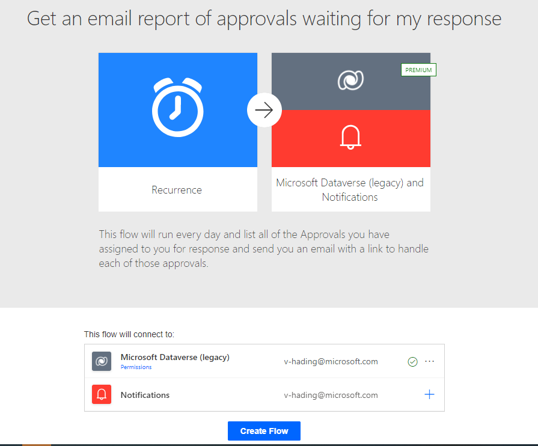
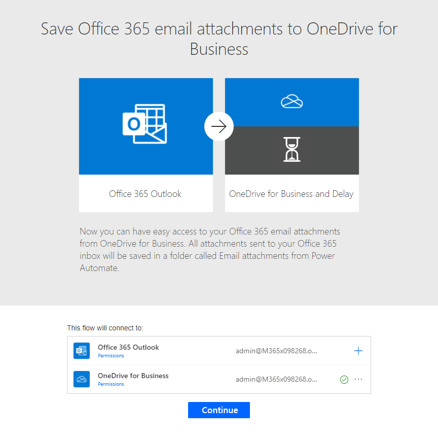

With the hundreds of triggers, actions and connectors, sometimes the hardest part about Power Automate can be figuring out where to get started. To help you get started, there are countless flow templates available to help you build a solution. To see all of the available templates you can sign into [Power Automate](https://ms.flow.microsoft.com/), and select **Templates** from the left-hand menu. 
    

From here, you can search by a specific word or phrase like "Common Data Service" or you can browse based on category. 

If you click on a specific template, you will see details about the template including the data sources it will connect to. 
    

Templates are great for getting started and support being customized. So you can take a template and extend it to meet your business needs.

## Create a flow to save email attachments to OneDrive for Business

It can be time consuming to search for attachments through email at Contoso Manufacturing. 
To alleviate those time consuming searches, you can build a flow that stores all of your email attachments in a folder on your Microsoft OneDrive for Business account. Thankfully, there is a template to help you get started. 

1. From the list of templates search for "**Save Office 365 email attachments to OneDrive for Business**" and then **click on the template** to start using it.

2. Click **Create Flow** at the bottom of the screen to create the flow.
    

**Save Office 365 email attachments to OneDrive for Business** is one of the one-click templates, in which you can answer questions that are necessary to build the flow, so that you don't have to write a line of code.

On the template graphic, there's a description of what the template does and what it needs to succeed.

You'll be asked to provide credentials for the Microsoft Office 365 Outlook and Microsoft OneDrive for Business services. If you regularly use both services, you'll already be signed in.

- The flow connects to your work email to get any attachments.

- The flow will then create a folder on your OneDrive for Business account to automatically put every attachment that's sent to your work email address in that folder.

Now that the flow is created, you can click Edit to see the details of what was created for you.

From the flow builder, you can now click through the trigger and the actions to see how this flow was built for you. As you can see, there is no code and everything is accessible to customize or extend to better meet your business needs. 
For example, maybe try configuring the flow to only process for emails from your boss. Here is a hint: Click on **Show advanced options** for the **On new email** trigger. 

Now that you have seen how easy it is to start from a template, let's talk about a couple of key concepts.

## Important concepts in Microsoft Power Automate

Keep these concepts in mind when building flows:

- Every flow has two main parts: a trigger, and one or more actions.

- You can think of the trigger as the starting action for the flow. The trigger can be something like a new email arriving in your inbox or a new item being added to a SharePoint list.

- Actions are what you want to happen when a trigger is invoked. For example, the new email trigger will start the action of creating a new file on OneDrive for Business. Other examples of actions include sending an email, posting a tweet, and starting an approval.

Some examples of types of actions you can have in a flow include:

-   **Loops** – Runs an action until conditions are met to move to the next step of the flow

-   **Switch** – Identifies a single case to execute based on the evaluation of input

-   **Do Until** – Executes a block of actions until a specified condition evaluates to true

-   **Apply to each** – Executes a block of actions for each item in the input array

-   **Expressions** – underlying definition that describes the actual logic that runs in your flow that can be manually written

You can also perform data operations in your flow, such as Compose, Create CSV table, Join, or Select. 
These concepts will come into play later when you build your own flows from scratch.

## Trigger or run the flow

With Power Automate, you do not think of running a flow the same way as you do
with running a Power Apps app. Instead, you perform the activity that triggers
the flow to run. In the case of the previous flow, instead of periodically
running the flow manually, it would automatically run every time a new email is
received with an attachment. This is because the flow has the trigger that
determines when it should run.

When defining triggers, there are a few different types:

-   **When something changes:** These are triggers that run when data is changed. It
    could be a new item created in SharePoint, a lead is updated in Dynamics, or
    when an event has been deleted from Outlook for example. The previous flow
    is an example of a flow that runs when something changes.

-   **On a schedule:** You can set up a flow to be triggered at a certain time of a
    day and with a recurrence. This allows for processes such as checking every
    day at 8 AM to see if there are account renewals pending and if so, sending
    an email to the necessary people.

-   **On a button press:** This trigger takes shape in many ways. This can be when a
    flow virtual button is run through the mobile app, or a physical button is
    clicked with 3rd party options, or even when a button is pressed inside of
    Power Apps. This gives you and/or the users control to "run" a flow on
    demand.

