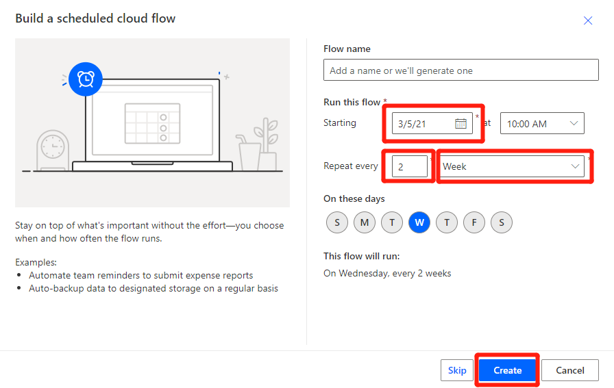
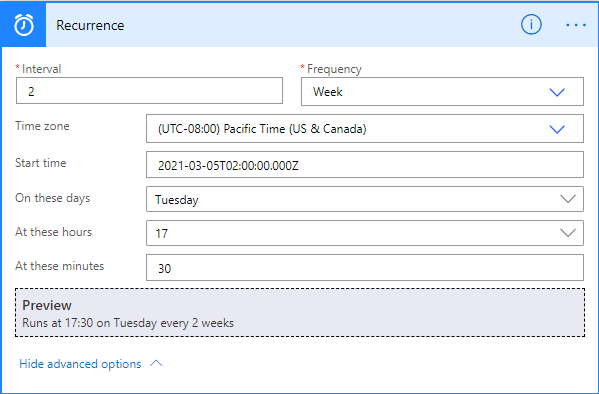

You can create a flow that performs one or more tasks (for example, sending a
report by email) on a specific schedule:

-   Once a day, an hour, or a minute

-   On a date that you specify

-   After a number of days, hours, or minutes that you specify

**Create the flow**
-------------------

1.  Launch [Power Automate](https://flow.microsoft.com/) and sign in using your organizational account.

2.  In the left pane, select **My flows**.

3.  Select **New**, and then select **Scheduled--from blank**.

4.  In the dialog box, specify the flow's name and how often the flow should run.

>   For example, if you want the flow to run every two weeks, enter *2* in
>   the **Interval** field, and select *Week* in the **Frequency** field. You
>   can also specify the day of the week your flow should run. The text at the
>   bottom of the dialog box explains your inputs in plain language.

5.  Once you are satisfied with your inputs, select **Create**.

**Specify advanced options**
----------------------------

1.  Once your flow is created, select the title of the **Recurrence** card to expand it. Select **Edit** and then **Show advanced options**.

>[!NOTE]
>   The advanced options vary, depending on the value of
>   the **Interval** and **Frequency** fields. If the dialog box that you see
>   does not match the graphic that follows, make sure that
>   the **Interval** and **Frequency** fields are set to the same values that
>   are shown in the graphic.

2.  Here you can specify a time zone to reflect the local time zone, Universal
    Coordinated Time (UTC), or another time zone.

3.  Specify the day or days of the week when the flow should run, and the time
    or times of day when the flow should run.

>   For example, set up the flow as shown in the following graphic to start it
>   no earlier than noon (Pacific time) on Monday, January 1, 2018, and to run
>   it every two weeks, at 5:30 PM (Pacific time) on Tuesday.

  

**Use the compose action**
--------------------------

Use the **Data Operation - Compose** (compose) action to save yourself from
entering identical data multiple times when you are designing a flow. For
example, if you need to enter an array of digits: [0,1,2,3,4,5,6,7,8,9] several
times while you design your flow, you could use the compose action to save the
array like this:

1.  Search for **Compose**, and then select the **Data Operation -
    Compose** (compose) action.

2.  Enter the array into the **Inputs** box you want to reference later:

  

>[!TIP]
>   For easier reference later, rename the **Compose** card by clicking on the
>   text "Compose" on the title bar of the **Compose** card.

When you need to access the contents of the compose action, do so via
the **Output** token on the **Add dynamic content from the apps and connectors
used in this flow** list by following these steps:

3.  Add an action such as **Data Operation – Join**.

4.  Select the control to which you would like to add the contents you saved in
    the compose action.

    The **Add dynamic content from the apps and connectors used in this
    flow** opens.

5.  On the **Add dynamic content from the apps and connectors used in this
    flow**, select the **Outputs** token that’s under the **Compose** category
    of the **Dynamic content** tab.

6.  Next Save the Flow in the top right corner

7.  Then select the back arrow in the top left corner next to the name of the
    Flow

8.  Finally, you can Run the Flow from the command bar at the top

