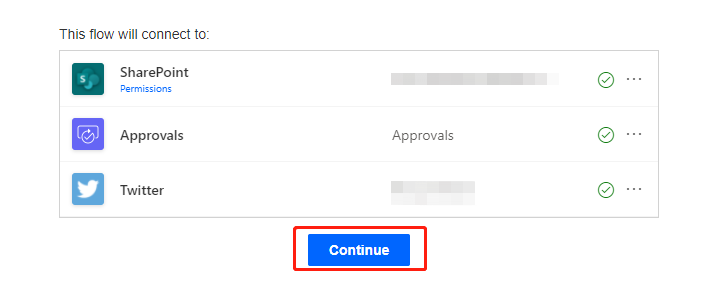
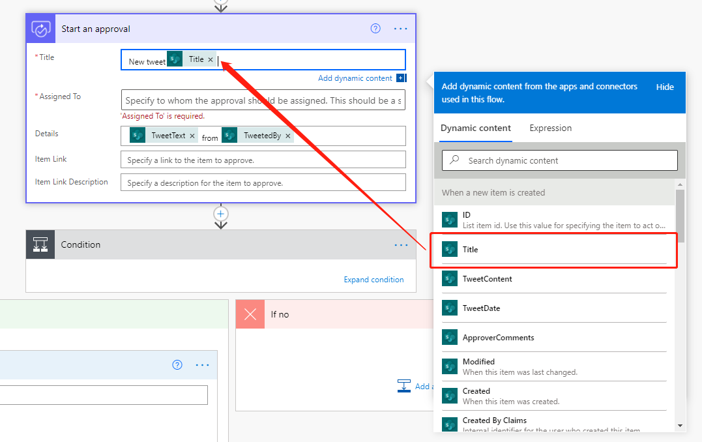
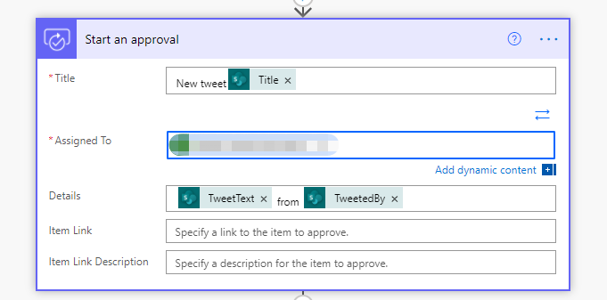
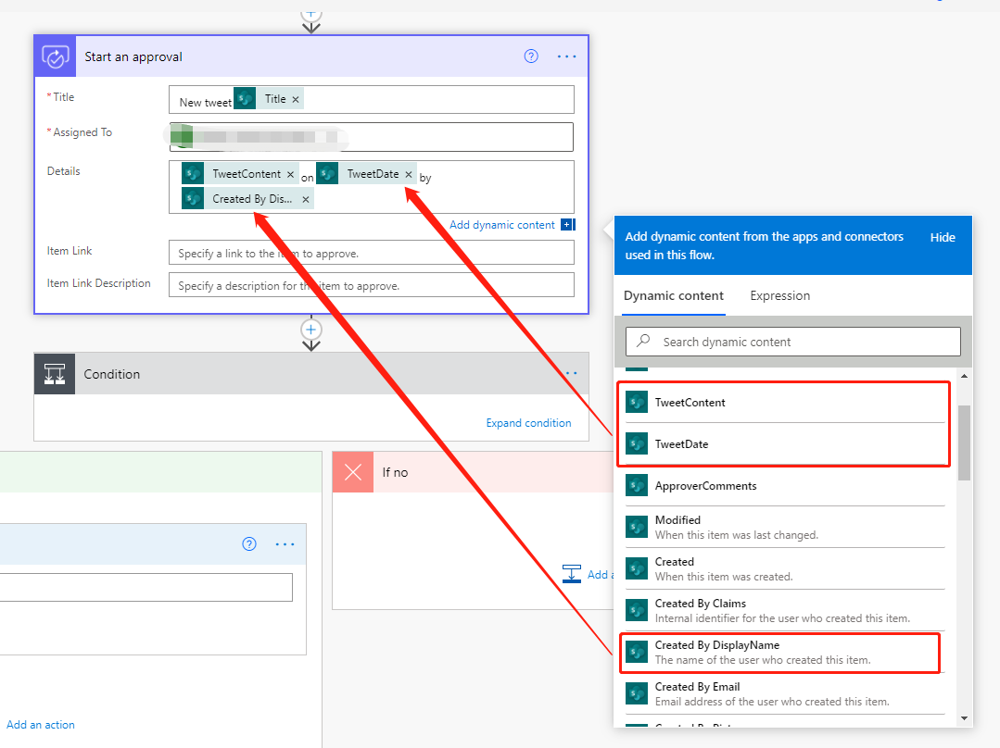
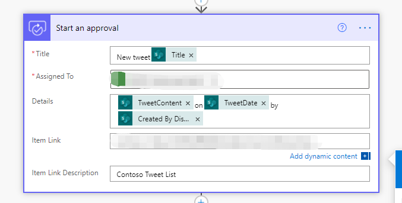
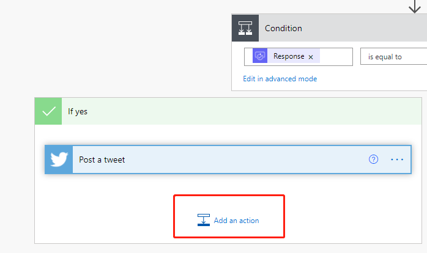
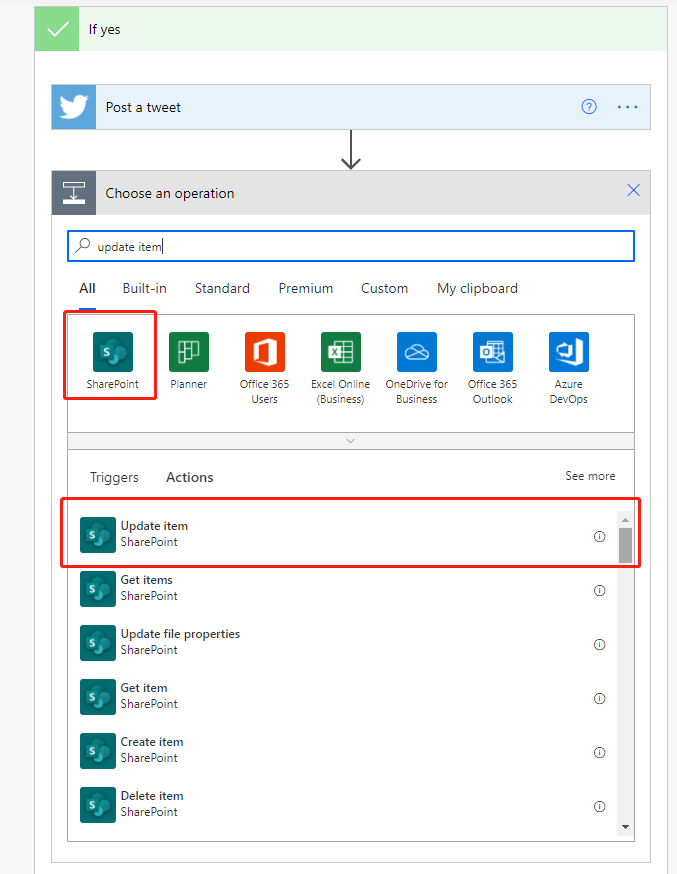
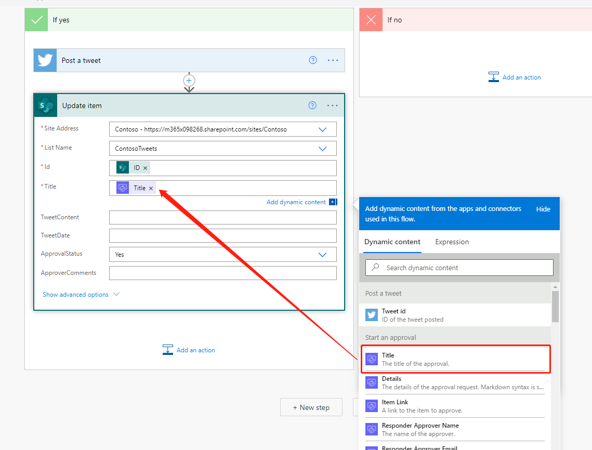
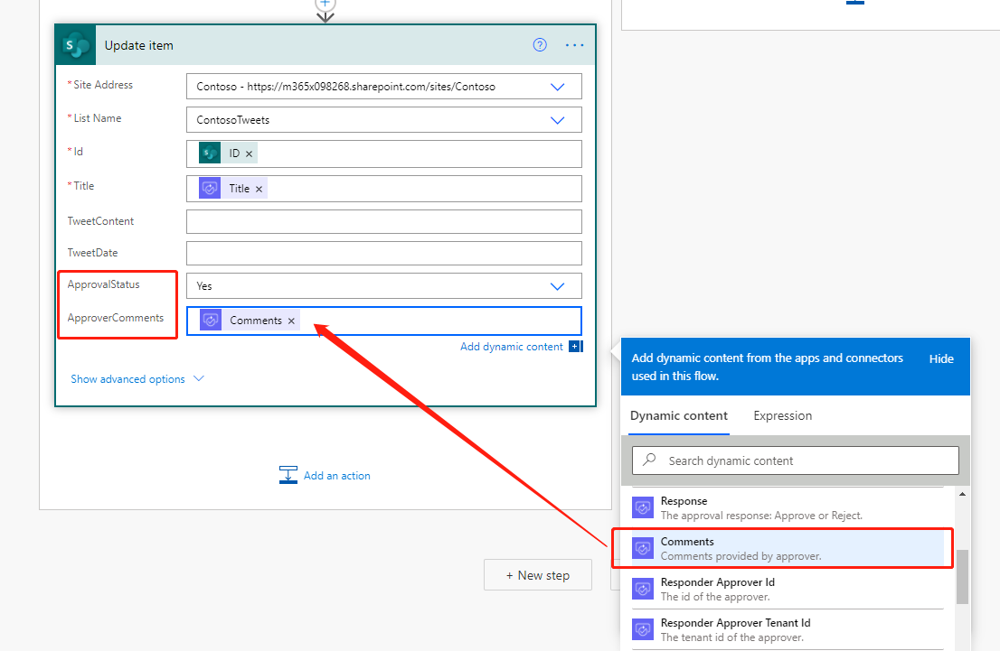

In this unit, you'll learn how to build a business-friendly scenario that uses approvals.

In this scenario, anyone who has access to the Microsoft SharePoint list can contribute tweets without knowing anything about Twitter. The social media team can then approve or reject those tweets. Therefore, that team remains in control of the account and the content that goes out to customers.

## Create a SharePoint list for tweets

You'll use a template that starts an approval process whenever a new item is created in a specific list. If the item is approved, a tweet is posted to Twitter. For this unit, you'll change the process by adding steps that update a SharePoint list with the approval response, indicate whether the item was approved, and add any comments that the approver added to the proposed tweet.

First, let's create the SharePoint list.

1. On your SharePoint site, create a SharePoint list named *ContosoTweets*.
    >[!NOTE]
    >If you are not familiar with creating a SharePoint list, more detailed steps are available here: [Create a list](https://support.microsoft.com/en-us/office/create-a-list-0d397414-d95f-41eb-addd-5e6eff41b083)

2. Open the list, and select **Add column**.

3. Select **+ Add column** to add the following columns. Select **Save** after you create each column.

    - Add a column of the *Multiple lines of text* type that's named *TweetContent*. This column will hold the content of the tweets that will be approved later.

    - Add a column of the *Date and Time* type that's named *TweetDate*. To select the *Date and Time* type, select **More**.

    - Add a column of the *Yes/No* type that's named *ApprovalStatus*. The approver can then select **Yes** or **No** to approve or reject the tweet.

    - Add a column of the *Single line of text* type that's named *ApproverComments*. The approver can then add a comment about the approval status.
    

4. Copy the URL of the SharePoint list. You'll use it when you create the flow.

## Create an approval request flow

1. Sign in to [Power Automate](https://ms.flow.microsoft.com/), and then select **Templates**.

2. Search for and select the **Post list items to Twitter after approval** template.  

3. Make sure that your account credentials for **SharePoint**, **Approvals**, and **Twitter** are correct, and then select **Continue**.  
    

4. Back in Microsoft Flow, in the **When a new item is created** action, enter the following values:

    - **Site Address**: Enter the URL of your team's SharePoint site.

    - **List Name**: Select *ContosoTweets*.      
        

5. In the **Start an approval action**, select **Edit** to show all the fields.  
    

6. In the **Title** field, enter *New tweet for*, and then select **Title** in the dynamic content list.  
    

7. In the **Assigned to** field, enter and select either your name or the name of a test user.  
    

8. In the **Details** field, remove the default items, and add **TweetContent**, **TweetDate**, and **Created by DisplayName** from the dynamic content list. Add the words *on* and *by* to make the content more readable, as shown here.  
    

9. In the **Item Link** field, paste the URL of your SharePoint list, which you copied in the previous procedure. In the **Item Link Description** field, enter *Contoso Tweet List*.      
    

10. In the **Condition** action, hover over the **IF YES** box, select the plus sign (**+**), and then select **Add an action**.  
    

11. Search for *update item*, select the **SharePoint** connector, and then select the **SharePoint – Update item** action.  
    

12. In the **Site Address**, enter the URL of the team's SharePoint site again. In the **List Name** field, select *ContosoTweets* again. In the **Id** field, add **ID** from the dynamic content list. The **Id** field is used to match the actual tweet request in the SharePoint list.  
    

13. Select the **Title** field, and then, in the dynamic content list, search for *title*. Add **Title** from the **When a new item is created** action.  
    

14. In the **ApprovalStatus** field, select *Yes*. Then select the **ApproverComments** field, and add **Comments** from the dynamic content list.  
    

15. Near the bottom of the **IF NO, DO NOTHING** box, select **Add an action**.  
    

16. Repeat steps 11 through 14 to create a **SharePoint – Update item** action. Set the same values that you set for the **IF YES** condition. The only difference is that you set the **ApprovalStatus** field to *No* this time.  
    

17. Select the **Post a tweet** action, and select **Edit**. Then select the **Tweet text** field, and add **TweetContent** from the dynamic content list. This step will create the actual tweet and then post it to Twitter when it's approved.  
    

18. Select **Save**.

Congratulations! You just created your first approval flow.

This unit showed another way that Power Automate can empower your team to be more productive. Your team can contribute ideas, relevant news, or product guidance, but you maintain control over what's tweeted out to customers.

## Use the approval center

Power Automate helps users to manage their approvals through the approval center. Choose **Approvals** under **Actions** on the left-hand menu. Here you will be able to see any approvals you have sent or received and your approval history. Click on the item you just sent to see the details. As you can see, Power Automate displays the details of the request including the requestor, approver, and outcome. You can approve or reject requests directly in your email, or you can come to the approval center and do so directly. Test out the approval center by sending off a few more requests and coming back to explore its functionality.

## Export the flow

Now that you have built a flow, you can also export the flow. You can export the flow from the flow details page.

When you export to a package, you can then send the resulting zip file to a co-worker in the same tenant to import or to someone in another tenant. The wizard will then walk them through importing the package and connecting it to their specific data sources.