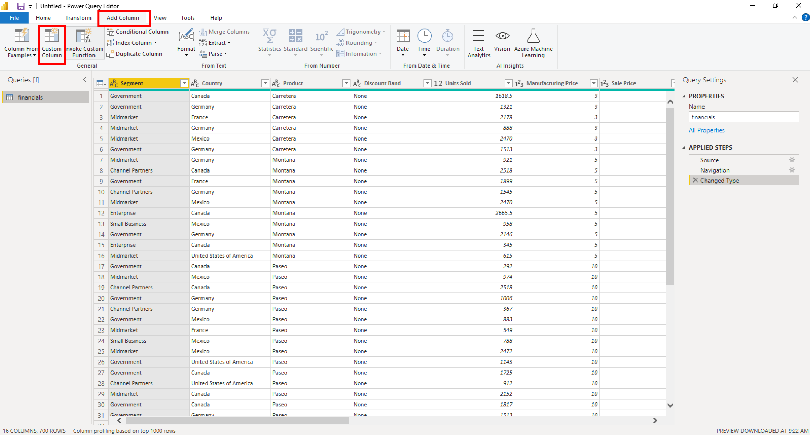
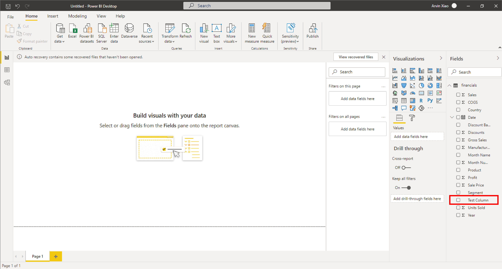
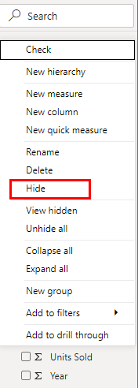
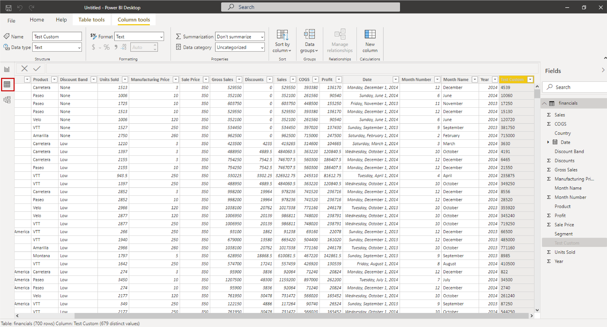
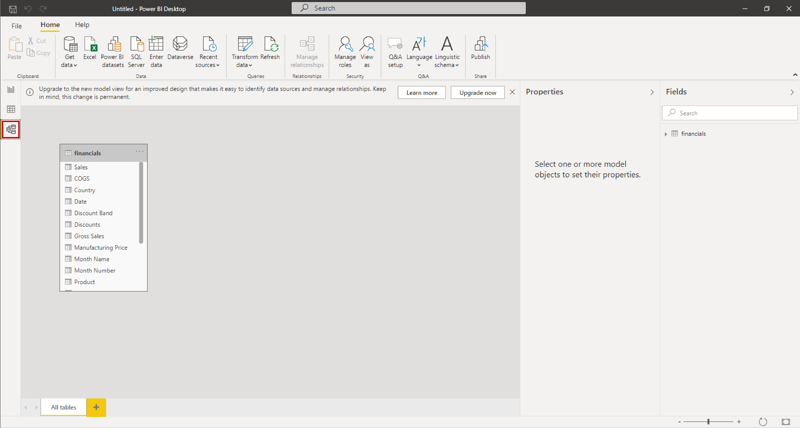

Data doesn't always come into your report clean, or ready to use. You may need additional columns or to rename or hide existing columns. You may have multiple data sources and need to define a relationship between them. All of these tasks are known as data transformation. While we will go over a couple of tasks here, you can explore this topic further [Model Data in Power BI](https://docs.microsoft.com/learn/modules/model-data-power-bi/).

## Custom Columns

Let's make a custom column using Power Query editor. 

1. Click on the **Edit Queries** button on the Home tab of the editing pane.

    

2. Select the **Add Column** tab and click **Custom Column**.

    

3. A dialogue box will open. Rename your column "Test Column" and double click on **Units Sold** in the available columns.

4. Type an asterisk (\*), and then click the column **Manufacturing Price** and the **Insert** button.

5. Click **OK**.

    

6. On the **Home** tab of the Edit Queries dialogue box, click **Close & Apply**.
    

You have successfully created a custom column. Although we won't be using this test column for visuals, you will need this skill to transform your data in the future.

> [!NOTE]
> For more information on calculated columns, including the use of IF statements, see Tutorial: [Create calculated columns in Power BI Desktop](https://docs.microsoft.com/power-bi/desktop-tutorial-create-calculated-columns?).

## Model Data

Now we that we have created a column that we don't need, let's hide it so that it doesn't get in the way of creating our visuals. There are many actions you can perform to transform your data in the Report building tab without going into Edit Queries.

1. On the fields pane, right click the newly created **Test Column**.
    

2. The callout displays many actions you can perform. Select **Hide in report view**.

    

We've explored Edit Queries and the Report building tab, but there are many ways to transform and model your data. The Data tab allows you to see a preview of your data and perform simple functions without entering the Edit Queries dialogue.
    

The Relationships tab is used for defining relationships between multiple tables or data sources. Relationships allow visuals to understand how data from multiple tables work together.
    

