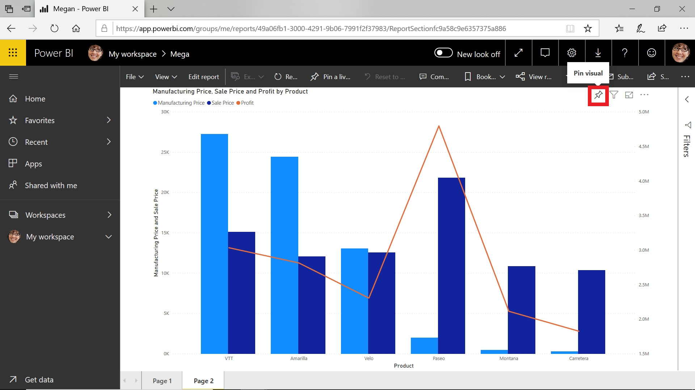
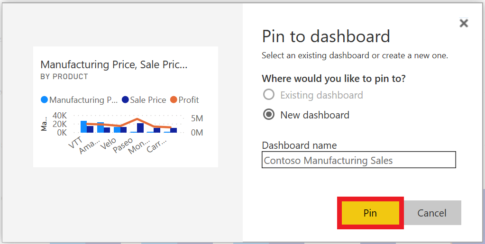
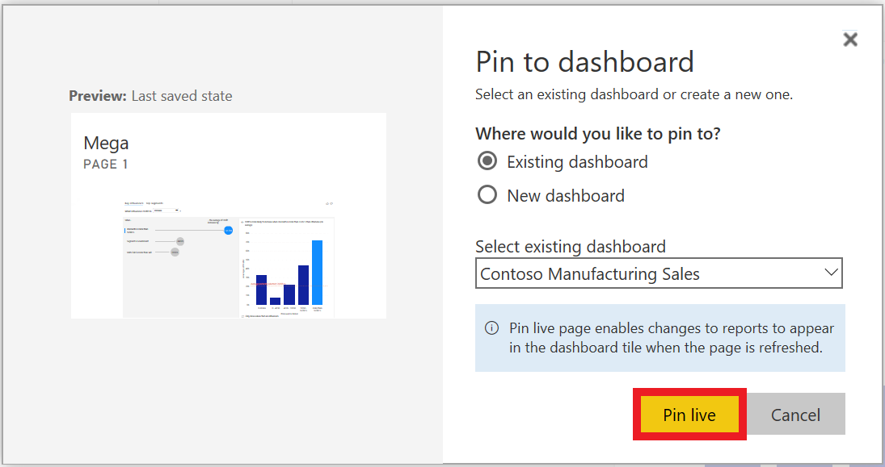
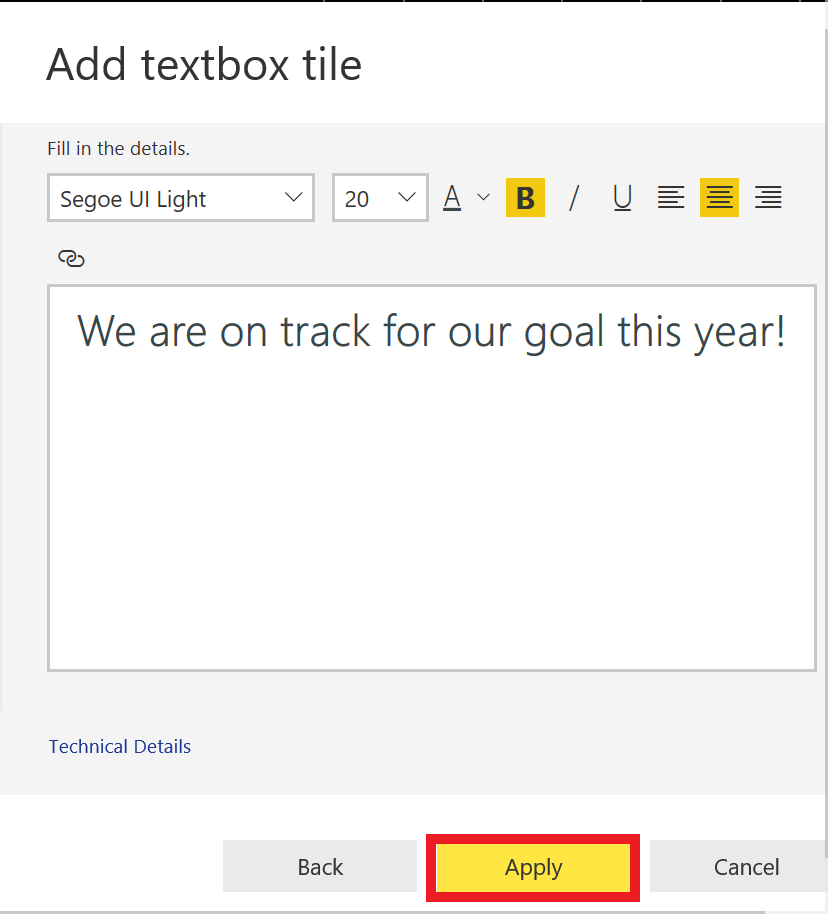
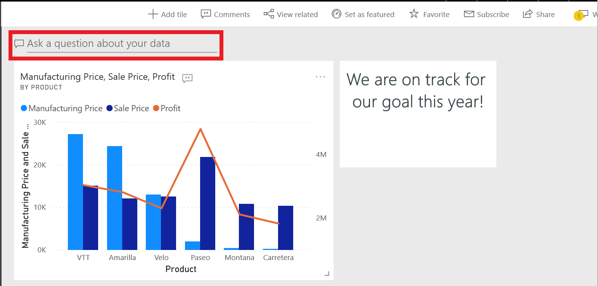
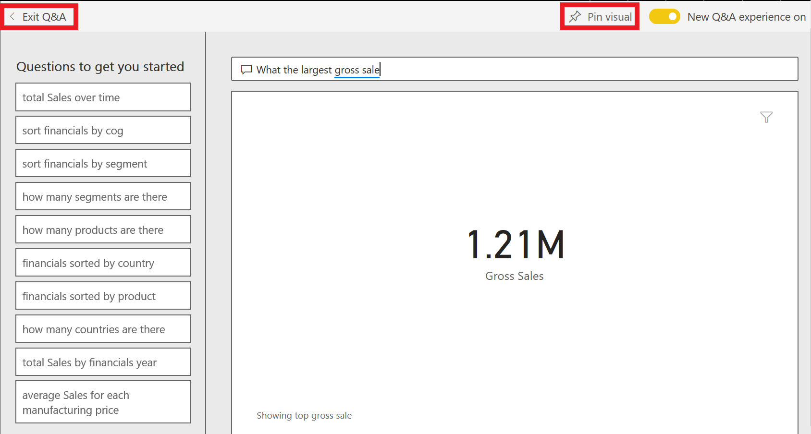
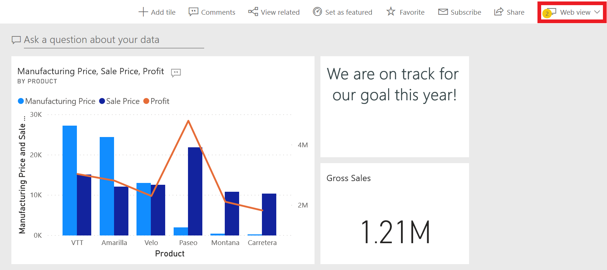
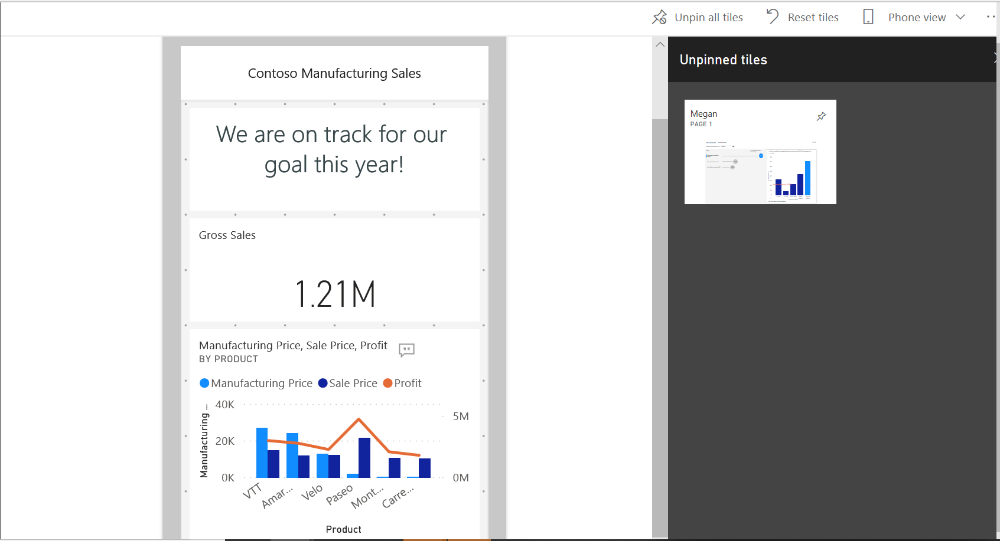

Up to this point we have been working in Power BI Desktop. Dashboards in Power BI are one-page collections of visualizations that are created from within the Power BI service (online). You can create dashboards by pinning visuals from reports.

If you clicked on the link from publishing your report, your report should now be open in your browser. Let's use this report to create a dashboard.

1. Visit Page 2 of your report. Hover over the clustered column chart and a small push pin will appear in the upper right corner of your visual.

2. Press the **pin**.

3. In the dialogue box, make sure **New Dashboard** is selected. For the dashboard name, type "Contoso Manufacturing Sales". Select **PIN**.

4. Go to the first page of your report.

5. You may notice that Key Influencers does not have the option to pin the visual when you hover over it. Instead, press the **Pin a Live Page** button at the top of your report.

6. In the dialogue box, make sure **Existing Dashboard** is selected. Ensure the dropdown shows "Contoso Manufacturing Sales". Select **Pin Live**.

7. A message will pop up with the option to **Go to Dashboard**. Click it.

8. You should now see the tile and live page you pinned. You can think of a dashboard like a cork board. All of your pinned visuals exist in a one-page scrollable platform from which you can collaborate. Hover over the column chart tile and select the ellipses in the upper right corner.

9. Select **Add a Comment**. From here you can type specific comments and even call out individuals in your company by using the @ symbol.

10. Type a comment and then close the comments pane. You will notice that a small text bubble symbol has appeared by the title of the visual. Press it to see your comment appear.

11. Close the comment pane again and select **Add Tile**.

12. Select **Text Box**.

13. Select **Next**.

14. Scroll down and add text. You can increase the font size or format the style. Select **Apply**.

15. The tile you just added is at the bottom of the report. Click and drag it to the top beside the column chart.

16. Hover over the visual and you will see two small lines at the bottom right corner. Click and drag them to resize the tile to be smaller (About a quarter the size of the column chart tile).

17. Click on the section **Ask a question about your data**.

18. A new pane will open over your dashboard where you can ask questions in real language of your data. Type "What is the largest gross sale". The resulting visual is known as a data card.

19. Select **Pin Visual**, and click **Pin**.

20. Exit Q&A.

20. The visual you created from the Q&A is at the bottom of your dashboard. Drag it up and resize it as you did with the text tile.

21. Select **Web View** in the top right and switch to Phone View.

22. Here you can change the size and order of tiles to view them better on mobile. Pin the text tile and data card tile to the mobile view and drag them to the top.

23. Unpin the live page tile and drag the column chart tile to be longer.

Now you have your very first dashboard with both web and mobile view. The only remaining step is sharing your dashboard with others.

