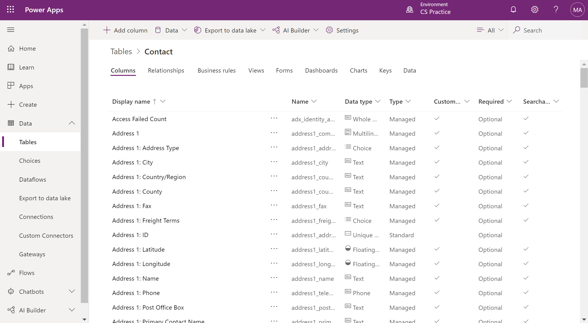

A table is a logical structure containing rows and columns that represents a set of data.  

Below you can see a screenshot of the standard contact table and various types of columns it includes.
    

## Types of tables

The two types of tables are:

- **Standard** - The base set of tables that are created for every instance of a Microsoft Dataverse database. You can add more columns to any table, but you can only delete columns from a custom table.

- **Complex** - Tables that contain complex, server-side business logic, including real-time workflows or plug-ins. Some of the tables that are used in Dynamics 365 applications are complex. Care must be taken if you add server-side logic to ensure that users have the proper license to use the complex table. Additional information about complex tables can be accessed by following the link within the summary unit of this module.

## Columns

Columns are a way to store a discrete piece of information within a row in a table. You might think of them as a column in Excel. Columns have data types, meaning that you can store data of a certain type in a column that matches that data type. For example, if you have a solution that requires dates, then you would store the date in a column with the type of Date. Similarly, if you want to store a number, then you store the number in a column with the type of Number.

The number of columns within a table varies from a few columns to a hundred or more. If you need more than a few hundred columns in a table, you might want to reconsider how you are structuring data storage for your solution because, likely, there is a better way.

Every database in Microsoft Dataverse starts with a standard set of tables and each standard table has a standard set of columns.

> [!TIP]
> Always use standard tables and columns when possible. You can rename a table if that makes the table more understandable in the context of your solution. Always review the list of standard tables and make sure a standard table will not meet your needs before you create a new table.