When you launch Power BI Desktop, the **Getting Started** dialog box will
appear, which provides useful links to forums, blogs, and introductory videos.

In Power BI Desktop, you will begin to build reports in the **Report** view. You
will be working in five main areas:

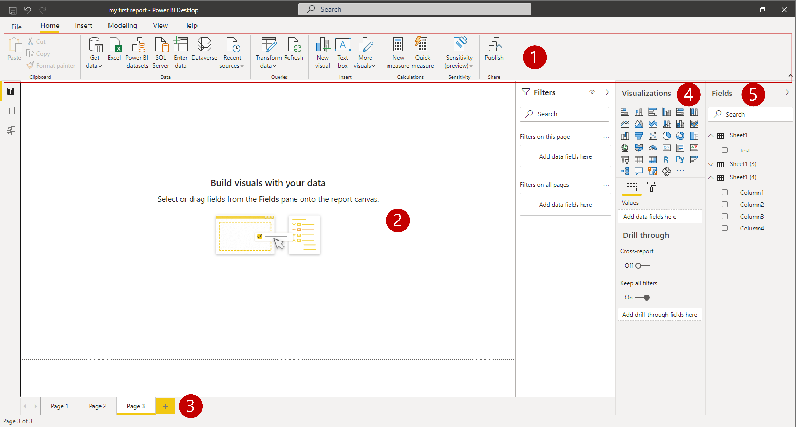

1.  **Ribbon** - Displays common tasks that are associated with reports and
    visualizations.

2.  **Report view, or canvas** - Where visualizations are created and arranged.

    1.  The **Data view** allows you to view all of your data available in your
        report. This is an easy way to quickly check data types and validate
        data.

    2.  The **Model view** allows you to visually set the relationship between
        tables or elements. A relationship is where two or more tables are
        linked together because they contain related data. This enables users to
        run queries for related data across multiple tables.

3.  **Pages tab** - Located along the bottom of the page, this area is where you
    would select or add a report page.

4.  **Visualizations pane** - Where you can change visualizations, customize
    colors or axes, apply filters, drag fields, and more.

5.  **Fields pane** - Where query elements and filters can be dragged onto
    the **Report** view or dragged to the **Filters** area of the Visualizations
    pane.

## Types of visualizations available in Power BI

Below are just some of the many different types of visualizations that can be added to Power BI reports, specified in Q&A, and
pinned to dashboards. 

### Area charts: Basic (Layered) and Stacked

The Basic Area chart is based on the line chart with the area between the axis
and line filled in.

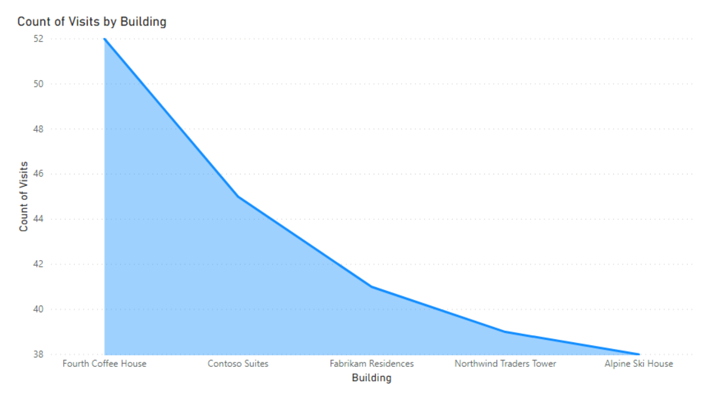

### Bar and column charts

Bar charts are the standard for looking at a specific value across different
categories.

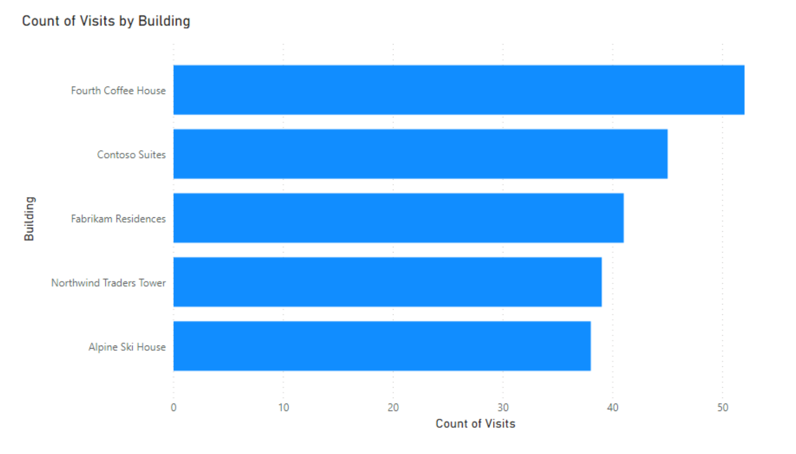

### Cards: Multi row

### Cards: Single number

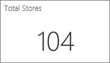

### Donut charts

Donut charts are similar to pie charts. They show the relationship of parts
to a whole.

### Gauge charts

Displays current status in the context of a goal.

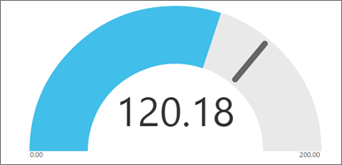

### KPIs

Displays progress toward a measurable goal.

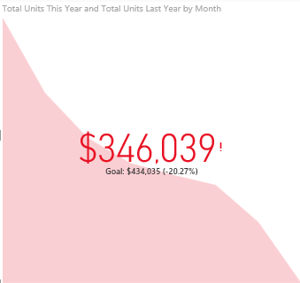

### Line charts

Emphasize the overall shape of an entire series of values, usually over time.

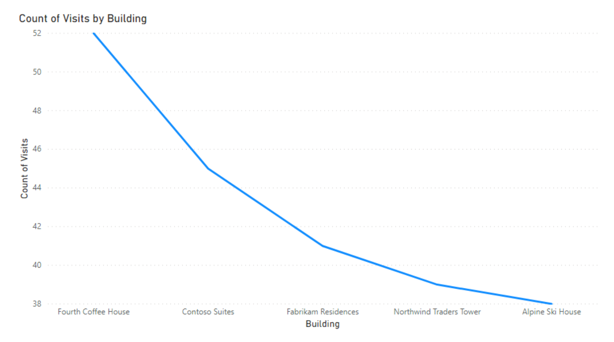

### Maps: Basic maps

Used to associate both categorical and quantitative information with spatial
locations.

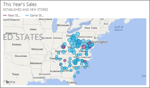

### Matrix

A table supports two dimensions, but a matrix makes it easier to display
data meaningfully across multiple dimensions -- it supports a stepped layout.
The matrix automatically aggregates the data and enables drill down.

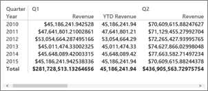

### Pie charts

Pie charts show the relationship of parts to a whole.

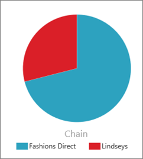

### Q&A visual

The Q&A visual lets you ask questions about your data using natural language.

### Tables

Work well with quantitative comparisons among items where there are many
categories.

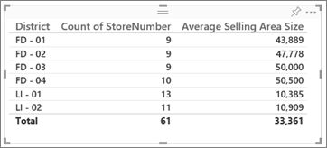

### Treemaps

Are charts of colored rectangles, with size representing value. They can be
hierarchical, with rectangles nested within the main rectangles.

### Waterfall charts

Waterfall charts show a running total as values are added or subtracted.

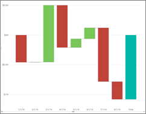

These are some of the out-of-the-box Power BI visuals available from the
visualization pane in Power BI Desktop and Power BI Service. However, sometimes
you need a more custom visual and these can be found in AppSource for Power BI.

## Custom visuals

### AppSource Power BI visuals

Microsoft and community members contribute Power BI visuals for public benefit,
and publish them to
the [AppSource](https://appsource.microsoft.com/marketplace/apps?product=power-bi-visuals).
You can download these visuals and add them to your Power BI reports. Microsoft
has tested and approved these Power BI visuals for functionality and quality.

>[!NOTE]
>-   By using Power BI visuals created with our SDK, you may be importing data
    from, or sending data to, third party or other services located outside of
    your Power BI tenant’s geographic area, compliance boundary, or national
    cloud instance.
>
>-   Power BI certified visuals are visuals in the AppSource that were
    additionally tested to check that the visual does not access external
    services or resources.
>
>-   Once Power BI visuals from AppSource are imported, visuals may be updated
    automatically without any additional notice.

### What is AppSource?

[AppSource](https://appsource.microsoft.com/marketplace/apps?product=power-bi-visuals) is
the place for apps, add-ins, and extensions for your Microsoft software.
AppSource connects millions of users of products such as Microsoft 365, Azure,
Dynamics 365, Cortana, and Power BI, to solutions that help them get work done
more efficiently and insightfully than before.

### Certified Power BI visuals

Certified Power BI visuals are visuals
in [AppSource](https://nam06.safelinks.protection.outlook.com/?url=https%3A%2F%2Fappsource.microsoft.com%2Fen-us%2Fmarketplace%2Fapps%3Fpage%3D1%26product%3Dpower-bi-visuals&data=02%7C01%7CKesem.Sharabi%40microsoft.com%7C6d9286afacb3468d4cde08d740b76694%7C72f988bf86f141af91ab2d7cd011db47%7C1%7C0%7C637049028749147718&sdata=igWm0e1vXdgGcbyvngQBrHQVAkahPnxPC1ZhUPntGI8%3D&reserved=0) that
meet certain specified code requirements that the Microsoft Power BI team has
tested and approved. The tests are designed to check that the visual doesn't
access external services or resources.

## Filter data with Power BI

Data is the core of Power BI. As you explore reports, each visual draws its
underlying data from sources that often contain far more data than you need.
Power BI offers several ways to filter and highlight reports. Knowing how to
filter data is the key to finding the right information.

> [!NOTE]
> Filtering only applies to reports, not to dashboards.

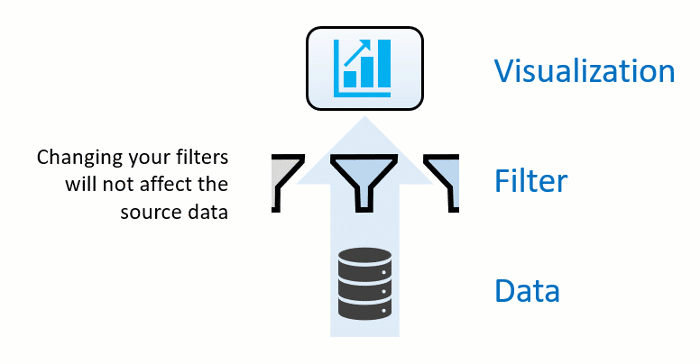

> [!NOTE]
> When you filter a visual like a bar chart, you are just changing the view of the data in that visual. You are not modifying the source data in any way.

### Slicers

A simple type of filtering that you can use directly on the report page is
called a **slicer**. Slicers provide cues to ways you can filter the results in
the visuals on a report page. There are several different types of slicers:
numeric, categorical, and date. Slicers make it easy to filter all the visuals
on the page at once.

If you want to select more than one field, hold the Ctrl key and click
additional fields.

### Explore the Filters pane

Another way to filter data is by opening and modifying filters in the Filters
pane. The Filters pane contains filters that were added to the report by the
report designer. As a consumer, you can interact with the filters and save your
changes but cannot add new filters.

The four types of filters are:

-   **Report** – Applies to all pages in the report.

-   **Page** – Applies to all the visuals on the current report page.

-   **Visual** – Applies to a single visual on a report page. You only see
    visual level filters if you have selected a visual on the report canvas.

-   **Drillthrough** – Allows you to explore successively more detailed views
    within a single visual.

## Use buttons in Power BI

Using **buttons** in Power BI lets you create reports that behave like apps, and
thereby, create an engaging environment so users can hover, click, and further
interact with Power BI content. You can add buttons to reports in **Power BI Desktop** 
and in the **Power BI service**. When you share your reports in the
Power BI service, they provide an app-like experience for your users.

To create a button in **Power BI Desktop**, on the **Insert** ribbon,
select **Buttons** and a drop-down menu appears, where you can select the button
you want from a collection of options, as shown in the following image.

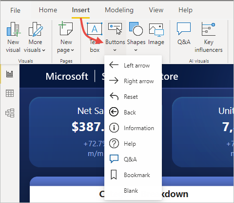

## Transform data

Sometimes, your data might contain extra data or have data in the wrong format.
Power BI Desktop includes the **Power Query Editor** tool, which can help you
shape and transform data so that it's ready for your models and visualizations.

### Launch Power Query Editor

To begin, select **Edit** from the **Navigator** window to launch Power Query
Editor. You can also launch Power Query Editor directly from Power BI Desktop by
using the **Edit Queries** button on the Home ribbon.

After loading your data into Power Query Editor, you'll see the following
screen:

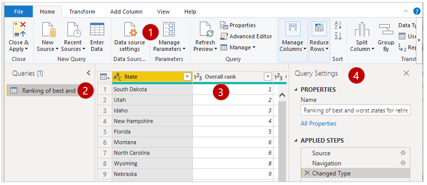

1.  In the ribbon, the active buttons enable you to interact with the data in
    the query.

2.  On the left pane, queries (one for each table, or entity) are listed and
    available for selecting, viewing, and shaping.

3.  On the center pane, data from the selected query is displayed and available
    for shaping.

4.  The **Query Settings** window lists the query’s properties and applied
    steps.

### How to transform data

On the center pane, right-clicking a column displays the available
transformations. Examples of the available transformations include removing a
column from the table, duplicating the column under a new name, or replacing
values. From this menu, you can also split text columns into multiples by common
delimiters.

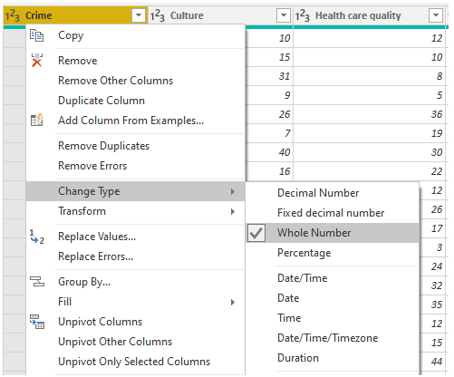

The Power Query Editor ribbon contains additional tools that can help you change
the data type of columns, add scientific notation, or extract elements from
dates, such as day of the week.

>[!TIP]
> If you make a mistake, you can undo any step from the **Applied Steps** list.
> 
> As you apply transformations, each step appears in the **Applied Steps** list on
the Query Settings pane. You can use this list to undo or review specific
changes, or even change the name of a step. To save your transformations,
select **Close & Apply** on the **Home** tab.

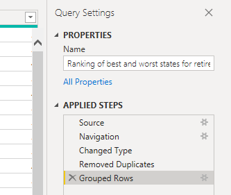

After you select **Close & Apply**, Power Query Editor applies the query changes
and applies them to Power BI Desktop.

For more information, see [Quickstart: Using Power Query in Power BI Desktop](https://docs.microsoft.com/power-query/power-query-quickstart-using-power-bi/).

## Clean data

While Power BI can import your data from almost any source, its visualization
and modeling tools work best with columnar data. Sometimes, your data won't be
formatted in simple columns, which is often the case with Excel spreadsheets.

In this unit, you will clean columnar data with Power Query Editor.

A table layout that looks good to the human eye might not be optimal for
automated queries. For example, the following spreadsheet has headers that span
multiple columns.

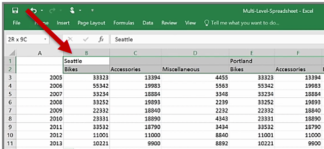

### How to clean data

Fortunately, Power Query Editor has tools to help you quickly transform
multi-column tables into datasets that you can use.

### Transpose data

By using **Transpose** in Power Query Editor, you can swap rows into columns to
better format the data.

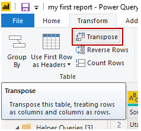

### Format data

You might need to format data so that Power BI can properly categorize and
identify that data. With some transformations, you'll cleanse data into a
dataset that you can use in Power BI. Examples of powerful transformations
include promoting rows into headers, using **Fill** to replace *null* values,
and **Unpivot Columns**.

With Power BI, you can experiment with transformations and determine which will
transform your data into the most usable columnar format. Remember,
the **Applied Steps** section of Power Query Editor records all your actions. If
a transformation doesn't work the way that you intended, select the **X** next
to the step, and then undo it.

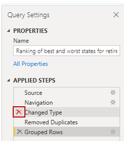

After you've cleaned your data into a usable format, you can begin to create
powerful visuals in Power BI.

For more information, see [Tutorial: Combine sales data from Excel and an OData
feed ](https://docs.microsoft.com/power-bi/desktop-tutorial-analyzing-sales-data-from-excel-and-an-odata-feed/).

## Work with aggregates in the Power BI service

### What is an aggregate?

Sometimes you want to mathematically combine values in your data. The
mathematical operation could be sum, average, maximum, count, and so on. When
you combine values in your data, it's called *aggregating*. The result of that
mathematical operation is an **aggregate**.

When Power BI service and Power BI Desktop create visualizations, they may
aggregate your data. Often the aggregate is just what you need, but other times
you may want to aggregate the values in a different way. For example, a sum
versus an average. There are several different ways to manage and change the
aggregate Power BI uses in a visualization.

First, let's take a look at data *types* because the type of data determines
how, and whether, Power BI can aggregate it.

### Types of data

Most datasets have more than one type of data. At the most basic level, the data
is either numeric or it isn't. Power BI can aggregate numeric data using a sum,
average, count, minimum, variance, and much more. The service can even aggregate
textual data, often called *categorical* data. If you try to aggregate a
categorical field by placing it in a numeric-only bucket
like **Values** or **Tooltips**, Power BI will count the occurrences of each
category or count the distinct occurrences of each category. Special types of
data, like dates, have a few of their own aggregate options: earliest, latest,
first, and last.

In the example below:

-   **Units Sold** and **Manufacturing Price** are columns that contain numeric
    data

-   **Segment**, **Country**, **Product**, **Month**, and **Month Name** contain
    categorical data

 

When creating a visualization in Power BI, the service will aggregate numeric
fields (the default is *sum*) over some categorical field. For example, "Units
Sold *by Product*", "Units Sold *by Month*" and "Manufacturing Price *by
Segment*". Power BI refers to some numeric fields as **measures**. It's easy to
identify measures in the Power BI report editor -- The **Fields** list shows
measures with the ∑ symbol next to them. See [The report editor... take a
tour](https://docs.microsoft.com/power-bi/create-reports/service-the-report-editor-take-a-tour) for
more info.

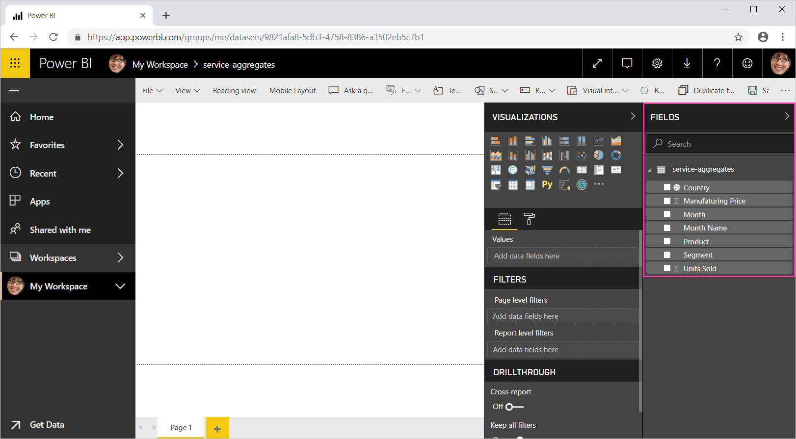 

### Why don't aggregates work the way I want them to?

Working with aggregates in Power BI service can be confusing. Maybe you have a
numeric field and Power BI won't let you change the aggregation. Or maybe you
have a field, like a year, and you don't want to aggregate it, you just want to
count the number of occurrences.

Typically, the underlying issue is the field definition in the dataset. Maybe
the dataset owner defined the field as text and that explains why Power BI can't
sum or average it. Unfortunately, [only the dataset owner can change the way a
field is
categorized](https://docs.microsoft.com/power-bi/transform-model/desktop-data-categorization).
So if you have owner permissions to the dataset, either in Desktop or the
program used to create the dataset (for example, Excel), you can fix this
problem. Otherwise, you'll need to contact the dataset owner for help.

### Change how a numeric field is aggregated

Say you have a chart that sums the units sold for different products, but you'd
rather have the average.

1.  Create a **Clustered column chart** that uses a measure and a category. In
    this example, we're using Units Sold by Product. By default, Power BI
    creates a chart that sums the units sold (drag the measure into
    the **Value** well) for each product (drag the category into
    the **Axis** well).

 

2.  In the **Visualizations** pane, right-click the measure, and select the
    aggregate type you need. In this case, we're selecting **Average**.

 

>[!NOTE]
>   The options available in the drop-down list will vary depending on 1) the
>   field selected and 2) the way the dataset owner categorized that field.

3.  Your visualization is now using aggregated by average.

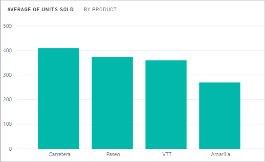 

### Ways to aggregate your data

Some of the options that may be available for aggregating a field:

-   **Do Not Summarize**. With this option chosen, Power BI treats each value in
    that field separately and doesn't summarize them. Use this option if you
    have a numeric ID column that the service shouldn't sum.

-   **Sum**. Adds all the values in that field up.

-   **Average**. Takes an arithmetic mean of the values.

-   **Minimum**. Shows the smallest value.

-   **Maximum**. Shows the largest value.

-   **Count (Not Blanks).** Counts the number of values in that field that
    aren't blank.

-   **Count (Distinct).** Counts the number of different values in that field.

-   **Standard deviation.**

-   **Variance**.

-   **Median**. Shows the median (middle) value. This value has the same number
    of items above and below. If there are two medians, Power BI averages them.
