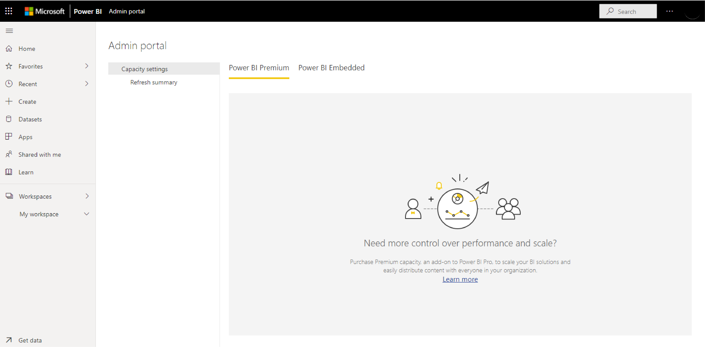

Security is at the forefront of data concerns. Administration is at the forefront of business concerns. Thankfully, Power BI's structure and capabilities make both simple to business users and administrators to provide peace of mind.

### Security

Similar to many Microsoft services, Power BI is built on Azure. This is Microsoft's cloud computing infrastructure and platform, which ensures the same level of security for Power BI as other Microsoft services. Users sign in with their credentials held in Azure Active Directory and control the level of sharing for every report, data or dashboard, determining whether recipients can edit or only view items. 

It's important to note that users are responsible for the data they share. If a user connects to data sources using their credentials, they can share a report (or dashboard, or dataset) based on that data. Users with whom the dashboard is shared aren't authenticated against the original data source and will be granted access to the report. This is beneficial to allow users to share reports and dashboards they have created but does require responsibility on the user's part.

For more in-depth information on Power BI security, be sure to check out the resources of this module in the last unit.

### Administration

Power BI administration is the management of a Power BI tenant, including the configuration of governance policies, usage monitoring, and provisioning of licenses, capacities, and organizational resources.
    

Power BI is designed for self-service business intelligence. The administrator is the guardian of data, processes, and policies in the Power BI tenant. A Power BI administrator is a key member of a team that includes BI developers, analysts, and other roles. The administrator can help support an organization to make sure that critical goals are met.

You can find more information on Power BI administration including roles, tasks and tools by accessing the links in the resources unit at the end of this module.
