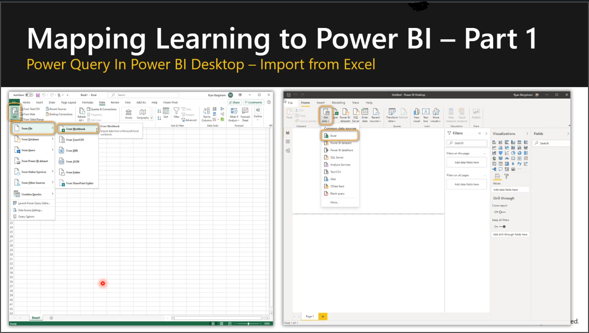

The key message is on the first slide of this module:

**Learning Power Pivot in Excel is a 2 for 1 deal!**

- What you learn in Excel is applicable to Power BI Desktop
- Only the look & feel is different from Excel to Power BI Desktop
- … And maybe there are a few Menu and Button name differences!

> [!IMPORTANT]
> Your goal in this module is to help your students leverage what they already know about Power Pivot tables and extend that knowledge into Power BI Desktop.

We are now at step 3 of the course journey:

* We level set with the class on Pivot tables.
* We introduced Power Pivot in Excel as an extension of what they knew about Pivot tables.
* We now are introducing Power BI as an extension of what they just learned about Power Pivot in Excel.

To do this you will show a side by side comparison of Power BI and Excel

## Connect to data sources
Whether in Excel or in Power BI Desktop, you’ll be able to connect to:

- Files
- Relational databases
- Data warehouses
- Line of Business Applications
- SaaS providers
- OLAP systems
- Cloud storage systems
- Web sources
- Social networks 
- Big data

> [!TIP]
> Be prepared to give examples of these data sources that match the industries of your customers.

## Video
> [!VIDEO https://www.microsoft.com/videoplayer/embed/RE4Ix0I]
> In this 8-minute video Krissy Dyess shows you how to explain that what your students learned in Excel is applicable to Power BI Desktop. Only the look & feel is different from Excel to Power BI Desktop.

> [!TIP]
> In addition to taking notes on the content, take notes on what worked with Krissy Dyess’ delivery, and where you would do things differently. 

