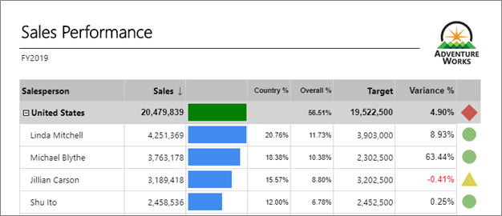

In this 10-minute lab, your students will enhance the design of the Sales Performance report with drilldown capabilities, and interactive sorting.

Your student's tasks in this lab are to:
1. Configure drilldown
2. Configure interactive sorting

> [!WARNING]
>  You must successfully complete Lab 05B before commencing this lab.

Lab document available at <CourseFolder>\PowerBIPRIAD\Lab06A

The final report will look like the following:

> [!Tip]
> Depending on the skill level of your students, you may want to deliver this as an instructor-led lab to help them get though the steps smoothly.

> [!IMPORTANT]
> You will need to run this and all of the other labs in this course prior to teaching the course.

## The lab scenario
The labs are based on the sales activities of the fictitious Adventure Works company.

### The Adventure Works company:
- Represents a bicycle manufacturer that sells bicycles and accessories to global markets
- Accumulates operational data in an Azure SQL Database
- Needs to explore and discover deeper insight from their data

## Your assignment
In the labs, as their report author, you will develop several sales performance reports.

The Adventure Works company scenario is for background only. It’s not very important to understand what the company does. 

## Lab setup
The setup instructions are available from: [https://aka.ms/priad-online-course#self-study-kit](https://aka.ms/priad-online-course#self-study-kit)

### Setup instructions:
1. Download the self-study kit (.zip) locally
1. Edit the file properties, and “unblock”
1. Extract the file contents to your file system 

The lab documents will refer to this location as <CourseFolder>

Full details and discussion about the self-study kit are found in the online documentation.

## Power BI account
You are responsible for having your own Power BI account.

### The Power BI account is required for two reasons: 
- To upload a Power BI Desktop file, which is a data source for report development. 
- To publish reports, which are optional and dependent on the student having access to a workspace of Premium capacity.

## Publishing
Some lab tasks involve publishing your paginated report to a workspace.
You can only open a paginated report when it has been saved to a workspace on dedicated capacity, which has the paginated reports workload enabled.

## Copy paste snippets
To improve accuracy and reduce typing, many labs involve copying and pasting from snippet files. 
When snippet files are available, do not copy from the lab documents. Rich-formatted text blocks often paste incorrectly, and you’re likely to get a strange result in your code.

- Avoid the temptation to just copy-and-paste.
- Take the time to understand the intention of each snippet.

